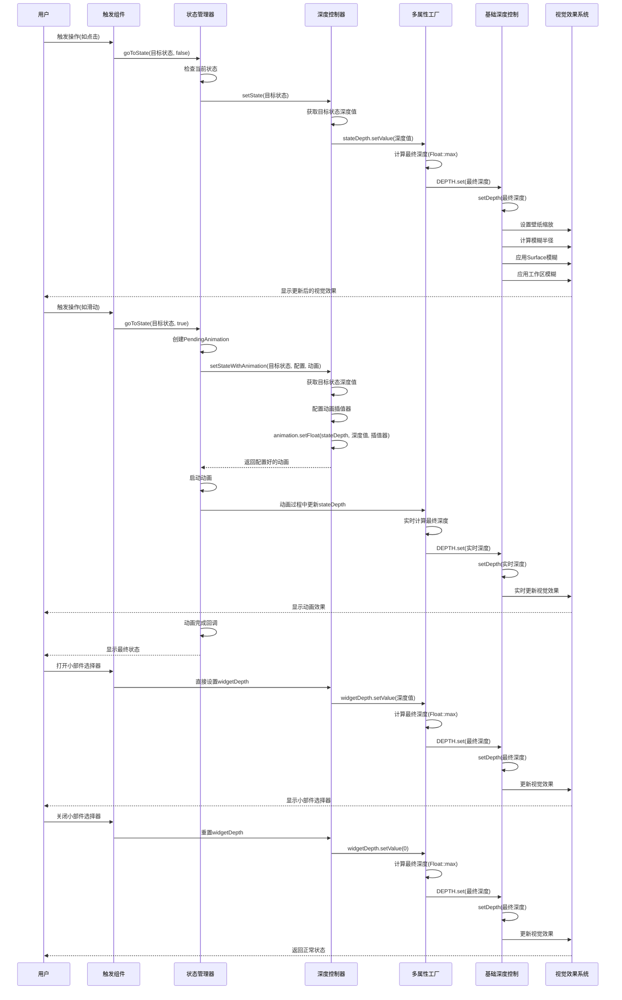

# DepthController 深度控制流程分析报告

## 1. 概述

DepthController 是 Android Launcher3 中的一个关键组件，负责控制 Launcher 表面的模糊效果和壁纸缩放。通过分析 `DepthController.java` 和 `BaseDepthController.java` 的源码，本文档详细阐述了 DEPTH、stateDepth 和 widgetDepth 的定义、调用流程、上游关系以及技术实现。

## 2. 核心组件定义与含义

### 2.1 DEPTH
- **定义**：`FloatProperty<BaseDepthController>` 类型的静态属性
- **路径**：`BaseDepthController.java:59-70`
- **含义**：核心深度控制属性，范围 0-1
  - 0：完全缩小（壁纸完全缩放，最大模糊效果）
  - 1：完全放大（壁纸原始大小，最小模糊效果）
- **作用**：直接控制壁纸缩放级别和模糊效果强度

### 2.2 stateDepth
- **定义**：`MultiProperty` 类型的实例属性
- **路径**：`BaseDepthController.java:81`
- **含义**：用于状态转换时的深度控制
- **作用**：在 Launcher 状态变化时（如从主屏幕到概览模式），控制深度变化的动画效果

### 2.3 widgetDepth
- **定义**：`MultiProperty` 类型的实例属性
- **路径**：`BaseDepthController.java:83`
- **含义**：用于小部件选择器的深度控制
- **作用**：在打开小部件选择器时，控制深度变化效果

## 3. 调用流程分析

### 3.1 初始化流程
1. **BaseDepthController 构造函数**
   - 创建 `MultiPropertyFactory`，关联 DEPTH 属性
   - 初始化 stateDepth 和 widgetDepth：
     ```java
     MultiPropertyFactory<BaseDepthController> depthProperty =
             new MultiPropertyFactory<>(this, DEPTH, DEPTH_INDEX_COUNT, Float::max);
     stateDepth = depthProperty.get(DEPTH_INDEX_STATE_TRANSITION);
     widgetDepth = depthProperty.get(DEPTH_INDEX_WIDGET);
     ```
   - 路径：`BaseDepthController.java:142-146`

### 3.2 顶层调用流程

#### 3.2.1 用户交互触发点
1. **OptionsPopupView.enterAllApps**
   - **触发方式**：用户点击打开所有应用按钮
   - **调用路径**：`OptionsPopupView.java:595`
   - **操作**：调用 `StateManager.goToState` 进入 ALL_APPS 状态

2. **OptionsPopupView.enterHomeGardening**
   - **触发方式**：用户点击进入主屏幕编辑模式
   - **调用路径**：`OptionsPopupView.java:601`
   - **操作**：调用 `StateManager.goToState` 进入 HOME_GARDENING 状态

3. **AccessibilityActionsView**
   - **触发方式**：辅助功能操作
   - **调用路径**：`AccessibilityActionsView.java:501`
   - **操作**：调用 `StateManager.goToState` 进入 ALL_APPS 状态

4. **KeyboardShortcutsDelegate**
   - **触发方式**：键盘快捷键操作
   - **调用路径**：`KeyboardShortcutsDelegate.java:131`
   - **操作**：调用 `StateManager.goToState` 进入 ALL_APPS 状态

5. **BaseWidgetSheet**
   - **触发方式**：完成小部件添加
   - **调用路径**：`BaseWidgetSheet.java:455`
   - **操作**：调用 `StateManager.goToState` 返回 NORMAL 状态

6. **FlingAnimation**
   - **触发方式**：用户拖拽操作
   - **调用路径**：`FlingAnimation.java:293`
   - **操作**：调用 `StateManager.goToState` 进入目标状态

7. **WorkspaceTouchListener**
   - **触发方式**：触摸操作返回主屏幕
   - **调用路径**：`WorkspaceTouchListener.java:111`
   - **操作**：调用 `StateManager.goToState` 返回 NORMAL 状态

#### 3.2.2 StateManager 调用流程
1. **StateManager.goToState**
   - **调用方式**：根据是否需要动画，调用不同方法
   - **接口**：`StateManager.goToState(STATE_TYPE, boolean, Runnable)`
   - **参数**：
     - 目标状态（如 NORMAL、ALL_APPS、OVERVIEW 等）
     - 是否带动画
     - 完成回调（可选）
   - **路径**：`StateManager.java:423-456`

2. **无动画状态切换**
   - **调用路径**：`StateManager.java:288-295`
   - **操作**：
     - 取消所有原子动画
     - 调用 `onStateTransitionStart`
     - **遍历所有 StateHandlers**，调用 `setState` 方法
     - 调用 `onStateTransitionEnd`

3. **带动画状态切换**
   - **调用路径**：`StateManager.java:390-397`
   - **操作**：
     - 创建 `PendingAnimation` 对象
     - **遍历所有 StateHandlers**，调用 `setStateWithAnimation` 方法
     - 添加动画监听器
     - 启动动画

#### 3.2.3 DepthController 注册流程
1. **QuickstepLauncher.collectStateHandlers**
   - **调用方式**：在 Launcher 初始化时被 StateManager 调用
   - **接口**：`collectStateHandlers(List<StateHandler<LauncherState>>)`
   - **操作**：
     - 调用父类 `collectStateHandlers`
     - 添加 `DepthController` 到 StateHandlers 列表：
       ```java
       @Override
       public void collectStateHandlers(List<StateHandler<LauncherState>> out) {
           super.collectStateHandlers(out);
           out.add(getDepthController());
       }
       ```
   - **路径**：`QuickstepLauncher.java:1325-1329`

### 3.3 stateDepth 调用流程

#### 3.3.1 直接设置方式
1. **DepthController.setState(LauncherState)**：
   - **调用方式**：直接调用 `setValue` 方法
   - **接口**：`MultiProperty.setValue(float)`
   - **参数**：`toState.getDepth(mLauncher)` - 目标状态的深度值
   - **路径**：`DepthController.java:147`
   - **代码**：
     ```java
     stateDepth.setValue(toState.getDepth(mLauncher));
     ```

2. **LauncherBackAnimationController**：
   - **调用方式**：直接调用 `setValue` 方法
   - **接口**：`MultiProperty.setValue(float)`
   - **参数**：`LauncherState.BACKGROUND_APP.getDepth(mLauncher)` - 后台应用状态的深度值
   - **路径**：`LauncherBackAnimationController.java:352-353`
   - **代码**：
     ```java
     mLauncher.getDepthController().stateDepth.setValue(
             LauncherState.BACKGROUND_APP.getDepth(mLauncher));
     ```

#### 3.3.2 动画设置方式
1. **DepthController.setStateWithAnimation()**：
   - **调用方式**：通过 `PendingAnimation.setFloat` 设置动画
   - **接口**：`PendingAnimation.setFloat(Object, String, float, Interpolator)`
   - **参数**：
     - `stateDepth` - 目标属性
     - `MULTI_PROPERTY_VALUE` - 属性名称
     - `toDepth` - 目标深度值
     - `config.getInterpolator(ANIM_DEPTH, LINEAR)` - 动画插值器
   - **路径**：`DepthController.java:161-162`
   - **代码**：
     ```java
     animation.setFloat(stateDepth, MULTI_PROPERTY_VALUE, toDepth,
             config.getInterpolator(ANIM_DEPTH, LINEAR));
     ```

2. **RecentsView**：
   - **调用方式**：使用 `ObjectAnimator.ofFloat` 创建动画
   - **接口**：`ObjectAnimator.ofFloat(Object, String, float...)`
   - **参数**：
     - `depthController.stateDepth` - 目标属性
     - `MULTI_PROPERTY_VALUE` - 属性名称
     - `targetDepth` - 目标深度值（根据任务视图类型计算）
   - **路径**：`RecentsView.java:5862-5863`
   - **代码**：
     ```java
     anim.play(ObjectAnimator.ofFloat(depthController.stateDepth, MULTI_PROPERTY_VALUE,
             targetDepth));
     ```

3. **LauncherActivityInterface**：
   - **调用方式**：通过 `PendingAnimation.addFloat` 添加动画
   - **接口**：`PendingAnimation.addFloat(Object, Property, float, float, Interpolator)`
   - **参数**：
     - `getDepthController().stateDepth` - 目标属性
     - `new LauncherAnimUtils.ClampedProperty<>(MULTI_PROPERTY_VALUE, fromDepthRatio, toDepthRatio)` -  clamped属性
     - `fromDepthRatio` - 起始深度值（后台应用状态）
     - `toDepthRatio` - 结束深度值（概览状态）
     - `LINEAR` - 动画插值器
   - **路径**：`LauncherActivityInterface.java:123-126`
   - **代码**：
     ```java
     pa.addFloat(getDepthController().stateDepth,
             new LauncherAnimUtils.ClampedProperty<>(
                     MULTI_PROPERTY_VALUE, fromDepthRatio, toDepthRatio),
             fromDepthRatio, toDepthRatio, LINEAR);
     ```

4. **TaskViewUtils**：
   - **调用方式**：通过 `PendingAnimation.setFloat` 设置动画
   - **接口**：`PendingAnimation.setFloat(Object, String, float, Interpolator)`
   - **参数**：
     - `depthController.stateDepth` - 目标属性
     - `MULTI_PROPERTY_VALUE` - 属性名称
     - `BACKGROUND_APP.getDepth(container)` - 目标深度值（后台应用状态）
     - `TOUCH_RESPONSE` - 动画插值器
   - **路径**：`TaskViewUtils.java:472-474`
   - **代码**：
     ```java
     out.setFloat(depthController.stateDepth, MULTI_PROPERTY_VALUE,
             BACKGROUND_APP.getDepth(container),
             TOUCH_RESPONSE);
     ```

5. **QuickstepTransitionManager**：
   - **调用方式**：使用 `ObjectAnimator.ofFloat` 创建动画
   - **接口**：`ObjectAnimator.ofFloat(Object, String, float...)`
   - **参数**：
     - `mLauncher.getDepthController().stateDepth` - 目标属性
     - `MULTI_PROPERTY_VALUE` - 属性名称
     - `BACKGROUND_APP.getDepth(mLauncher)` - 目标深度值（后台应用状态）
   - **路径**：`QuickstepTransitionManager.java:1244-1246`
   - **代码**：
     ```java
     ObjectAnimator backgroundRadiusAnim = ObjectAnimator.ofFloat(
             mLauncher.getDepthController().stateDepth, MULTI_PROPERTY_VALUE,
             BACKGROUND_APP.getDepth(mLauncher))
     ```

#### 3.2.3 上游调用方
- **StateManager**：状态管理系统在状态变化时调用 `DepthController.setState()` 和 `setStateWithAnimation()`
- **RecentsView**：在最近任务视图切换时创建深度动画
- **LauncherBackAnimationController**：在返回动画开始时直接设置深度
- **LauncherActivityInterface**：在活动转换时添加深度动画
- **TaskViewUtils**：在任务视图操作时设置深度动画
- **QuickstepTransitionManager**：在快速步骤过渡时创建深度动画

### 3.4 widgetDepth 调用流程

#### 3.4.1 小部件选择器调用
1. **QuickstepLauncher.onWidgetsTransition(float)**：
   - **调用方式**：直接调用 `setValue` 方法
   - **接口**：`MultiProperty.setValue(float)`
   - **参数**：
     - `Utilities.mapToRange(progress, 0f, 1f, 0f, getDeviceProfile().getBottomSheetProfile().getBottomSheetDepth(), EMPHASIZED)`
     - 计算逻辑：将小部件选择器的进度值映射到对应的深度值范围
   - **路径**：`QuickstepLauncher.java:1050-1052`
   - **代码**：
     ```java
     getDepthController().widgetDepth.setValue(Utilities.mapToRange(
             progress, 0f, 1f, 0f,
             getDeviceProfile().getBottomSheetProfile().getBottomSheetDepth(), EMPHASIZED));
     ```

#### 3.3.2 调用时机
- **触发条件**：当小部件选择器打开或关闭时
- **调用逻辑**：根据小部件选择器的显示进度（0到1），动态计算并设置对应的深度值
- **特点**：使用 `Utilities.mapToRange` 方法实现平滑的深度过渡效果

### 3.4 核心处理流程
1. **MultiProperty 机制**：
   - 当 stateDepth 或 widgetDepth 的值变化时，MultiPropertyFactory 会根据 `Float::max` 策略计算最终深度值
   - 调用 DEPTH.set() 方法，传入计算后的深度值

2. **深度值处理**：
   - DEPTH.set() 调用 `BaseDepthController.setDepth(float)`：
     ```java
     private void setDepth(float depth) {
         depth = Utilities.boundToRange(depth, 0, 1);
         // 深度值处理逻辑...
         if (Float.compare(mDepth, depthF) == 0) {
             return;
         }
         mDepth = depthF;
         applyDepthAndBlur();
     }
     ```
   - 路径：`BaseDepthController.java:334-353`

3. **深度与模糊效果应用**：
   - `applyDepthAndBlur()` 方法应用深度和模糊效果：
     - 设置壁纸缩放：`mWallpaperManager.setWallpaperZoomOut(windowToken, depth)`
     - 计算并应用模糊半径：基于深度值计算模糊强度
     - 处理跨窗口模糊：根据 `mCrossWindowBlursEnabled` 状态
     - 路径：`BaseDepthController.java:190-270`

## 4. 上游调用关系

### 4.1 状态管理系统
- **调用方**：`StateManager`
- **调用时机**：当 Launcher 状态变化时（如主屏幕 ↔ 概览模式）
- **调用方式**：
  - 直接状态切换：调用 `DepthController.setState()`
  - 带动画的状态切换：调用 `DepthController.setStateWithAnimation()`

### 4.2 动画控制器
- **调用方**：各种动画控制器
  - `AllAppsSwipeController`
  - `LauncherBackAnimationController`
  - `RecentsAtomicAnimationFactory`
  - `ScalingWorkspaceRevealAnim`
- **调用时机**：执行各种过渡动画时
- **调用方式**：通过 `PendingAnimation` 设置 stateDepth 的动画值

### 4.3 小部件选择器
- **调用方**：`QuickstepLauncher`
- **调用时机**：当打开或关闭小部件选择器时
- **调用方式**：调用 `widgetDepth.setValue()` 设置深度值

### 4.4 其他触发点
- **Surface 变化**：当基础 Surface 变化时，会重新应用深度和模糊效果
- **模糊状态变化**：当跨窗口模糊状态变化时，会重新应用深度和模糊效果
- **绘制事件**：Launcher 绘制时会确保 Surface 有效，间接影响深度效果

## 5. 技术要点分析

### 5.1 深度值映射
- **壁纸缩放**：深度值直接映射到壁纸缩放级别
- **模糊强度**：通过 `mapDepthToBlur()` 方法将深度值映射到模糊半径：
  ```java
  private static float mapDepthToBlur(float depth) {
      return Interpolators.clampToProgress(depth, 0, 0.3f);
  }
  ```
  - 路径：`BaseDepthController.java:422-424`

### 5.2 性能优化
- **深度值去重**：对深度值进行舍入处理，避免频繁、不可感知的更新
  ```java
  int depthI = (int) (depth * 256);
  depthF = depthI / 256f;
  ```
  - 路径：`BaseDepthController.java:345-346`

- **模糊效果优化**：跳过微小的模糊变化，减少不必要的渲染操作
  ```java
  if (skipSimilarBlur && delta < Utilities.dpToPx(1) && newBlur != 0 && previousBlur != 0
          && blurAmount != 1f) {
      return;
  }
  ```
  - 路径：`BaseDepthController.java:235-239`

### 5.3 视觉效果增强
- **早期唤醒**：当执行昂贵的模糊操作时，通知 SurfaceFlinger 调整内部偏移，避免卡顿
  ```java
  if (wantsEarlyWakeUp && !mInEarlyWakeUp) {
      setEarlyWakeup(surfaceTransaction.getTransaction(), true);
  }
  ```
  - 路径：`BaseDepthController.java:255-256`

- **工作区模糊**：根据状态和模糊设置，为工作区应用模糊效果
  ```java
  mLauncher.getDepthBlurTargets().forEach(target -> target.setRenderEffect(blurEffect));
  ```
  - 路径：`BaseDepthController.java:330`

## 6. 调用流程图

```mermaid
flowchart TD
    subgraph 顶层调用触发点
        A1[用户点击] -->|打开所有应用| B1[OptionsPopupView.enterAllApps]
        A2[用户点击] -->|进入编辑模式| B2[OptionsPopupView.enterHomeGardening]
        A3[辅助功能] -->|打开所有应用| B3[AccessibilityActionsView]
        A4[键盘快捷键] -->|打开所有应用| B4[KeyboardShortcutsDelegate]
        A5[小部件操作] -->|完成添加| B5[BaseWidgetSheet]
        A6[拖拽操作] -->|完成拖拽| B6[FlingAnimation]
        A7[触摸操作] -->|返回主屏幕| B7[WorkspaceTouchListener]
    end

    subgraph 状态管理系统
        B1 --> C[StateManager.goToState]
        B2 --> C
        B3 --> C
        B4 --> C
        B5 --> C
        B6 --> C
        B7 --> C
        C -->|无动画| D[StateManager.setState]
        C -->|有动画| E[StateManager.setStateWithAnimation]
        D --> F[遍历StateHandlers]
        E --> G[遍历StateHandlers]
    end

    subgraph 上游调用方
        F --> H[DepthController.setState]
        G --> I[DepthController.setStateWithAnimation]
        J[RecentsView] -->|最近任务切换| K[ObjectAnimator.ofFloat]
        L[LauncherBackAnimationController] -->|返回动画开始| M[直接设置深度]
        N[LauncherActivityInterface] -->|活动转换| O[PendingAnimation.addFloat]
        P[TaskViewUtils] -->|任务视图操作| Q[PendingAnimation.setFloat]
        R[QuickstepTransitionManager] -->|快速步骤过渡| S[ObjectAnimator.ofFloat]
        T[QuickstepLauncher] -->|小部件选择器| U[直接设置深度]
    end

    subgraph 深度控制器
        H --> V[stateDepth.setValue]
        I --> W[animation.setFloat]
        K --> V
        M --> V
        O --> V
        Q --> V
        S --> V
        U --> X[widgetDepth.setValue]
        V --> Y[MultiPropertyFactory]
        X --> Y
        Y -->|Float::max 策略| Z[计算最终深度]
        Z --> AA[DEPTH.set]
        AA --> BB[BaseDepthController.setDepth]
        BB --> CC[应用深度和模糊]
    end

    subgraph 效果应用
        CC --> DD[设置壁纸缩放]
        CC --> EE[计算模糊半径]
        CC --> FF[应用Surface模糊]
        CC --> GG[处理早期唤醒]
        CC --> HH[应用工作区模糊]
    end

    style C fill:#000,stroke:#333,stroke-width:2px
    style H fill:#f9f,stroke:#333,stroke-width:2px
    style I fill:#f9f,stroke:#333,stroke-width:2px
    style V fill:#f9f,stroke:#333,stroke-width:2px
    style X fill:#f9f,stroke:#333,stroke-width:2px
    style Y fill:#bbf,stroke:#333,stroke-width:2px
    style Z fill:#bbf,stroke:#333,stroke-width:2px
    style AA fill:#bbf,stroke:#333,stroke-width:2px
    style BB fill:#bbf,stroke:#333,stroke-width:2px
    style CC fill:#bfb,stroke:#333,stroke-width:2px
```



## 7. 时序图



## 8. 代码优化建议

### 8.1 代码结构优化
- **建议**：将 `applyDepthAndBlur()` 方法拆分为更小的职责单一方法
- **理由**：当前方法超过 100 行，包含多个职责（壁纸缩放、模糊计算、Surface 处理等），不利于维护

### 8.2 性能优化
- **建议**：增加深度值变化的阈值判断，进一步减少不必要的更新
- **理由**：当前的舍入处理已经减少了更新，但可以根据实际视觉效果，设置一个更大的阈值

### 8.3 可测试性优化
- **建议**：为深度计算和模糊映射逻辑添加单元测试
- **理由**：这些核心逻辑直接影响用户体验，确保其正确性非常重要

### 8.4 可读性优化
- **建议**：增加更多的注释，特别是对于深度值与模糊效果之间的映射关系
- **理由**：深度控制逻辑较为复杂，详细的注释有助于后续维护

## 9. 结论

DepthController 系统通过 DEPTH、stateDepth 和 widgetDepth 三个核心组件，实现了 Launcher 在不同状态下的深度和模糊效果控制。其设计采用了属性动画和 Surface 控制的结合，确保了视觉效果的平滑过渡和性能的优化。

- **DEPTH**：核心深度控制属性，直接影响壁纸缩放和模糊效果
- **stateDepth**：处理状态转换时的深度变化，确保状态切换的视觉连贯性
- **widgetDepth**：处理小部件选择器的深度变化，提供专门的视觉体验

这种设计不仅实现了复杂的视觉效果，还通过一系列优化措施确保了性能的稳定，是 Android Launcher 视觉体验的重要组成部分。通过本文档的分析，我们对 DepthController 的工作原理有了更深入的理解，为后续的开发和优化提供了参考。

## 9. 参考文件

- `quickstep/src/com/android/launcher3/statehandlers/DepthController.java`
- `quickstep/src/com/android/quickstep/util/BaseDepthController.java`
- `quickstep/src/com/android/launcher3/uioverrides/QuickstepLauncher.java`
- `quickstep/src/com/android/quickstep/views/RecentsView.java`
- `quickstep/src/com/android/quickstep/LauncherBackAnimationController.java`
- `quickstep/src/com/android/quickstep/LauncherActivityInterface.java`
- `quickstep/src/com/android/quickstep/TaskViewUtils.java`
- `quickstep/src/com/android/launcher3/QuickstepTransitionManager.java`
- `src/com/android/launcher3/touch/AllAppsSwipeController.java`
