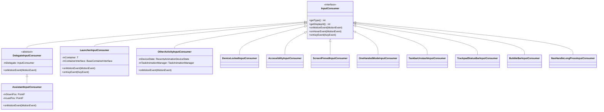
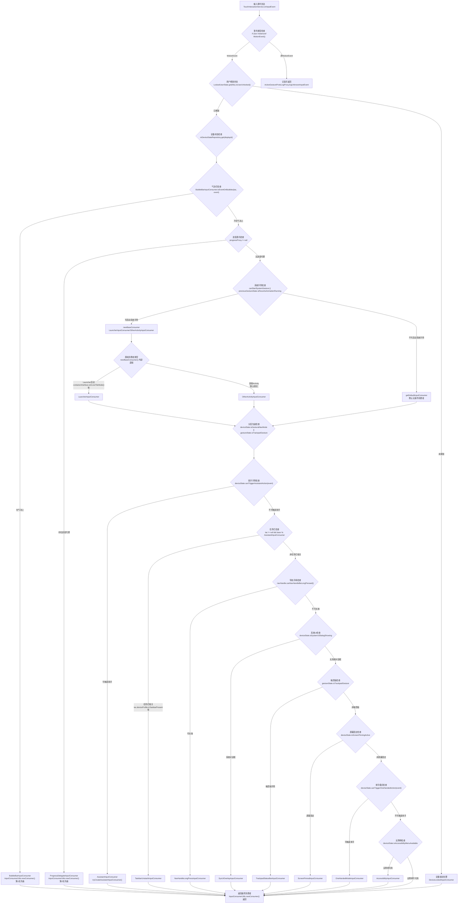
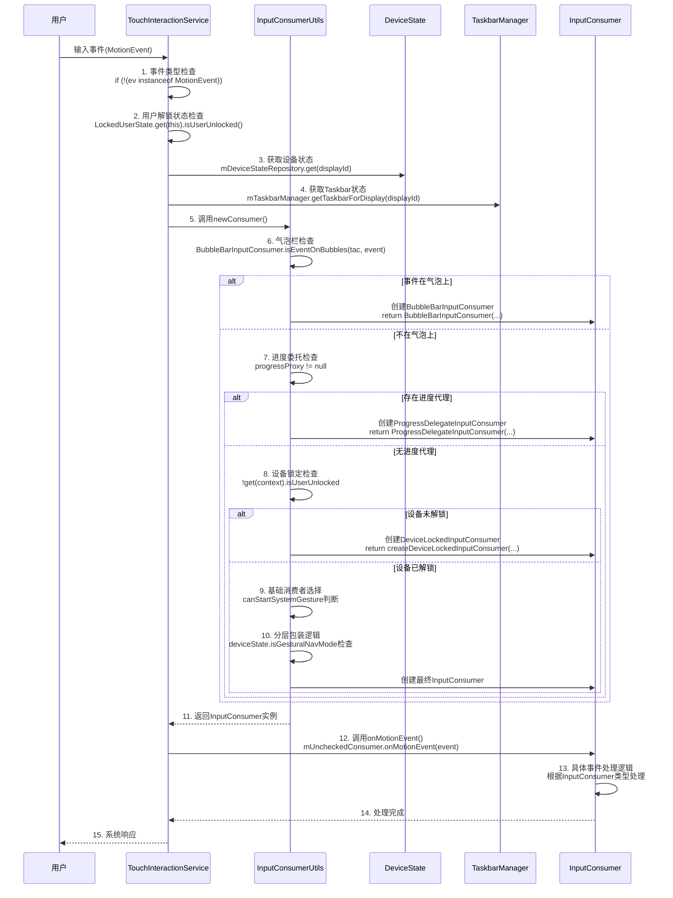

# InputConsumer架构分析报告

## 概述

本文档基于对AOSP Launcher3源码的深入分析，详细解析了`InputConsumer`接口及其实现类的架构设计、触发条件和作用机制。分析范围涵盖`TouchInteractionService`中的输入事件处理流程，以及所有InputConsumer实现类的功能特性。

## 1. InputConsumer接口定义

### 1.1 接口位置
- **文件路径**: `quickstep/src/com/android/quickstep/InputConsumer.java`
- **接口类型**: 输入事件消费者接口

### 1.2 核心类型定义
```java
public interface InputConsumer {
    int TYPE_NO_OP = 1 << 0;                    // 无操作类型
    int TYPE_LAUNCHER = 1 << 1;                 // Launcher输入处理
    int TYPE_OTHER_ACTIVITY = 1 << 2;           // 其他Activity输入处理
    int TYPE_ASSISTANT = 1 << 3;                // 助手输入处理
    int TYPE_DEVICE_LOCKED = 1 << 4;            // 设备锁定状态输入处理
    int TYPE_ACCESSIBILITY = 1 << 5;            // 无障碍功能输入处理
    int TYPE_SCREEN_PINNED = 1 << 6;            // 屏幕固定状态输入处理
    int TYPE_LAUNCHER_WITHOUT_FOCUS = 1 << 7;   // 无焦点Launcher输入处理
    int TYPE_RESET_GESTURE = 1 << 8;            // 手势重置处理
    int TYPE_PROGRESS_DELEGATE = 1 << 9;        // 进度委托处理
    int TYPE_SYSUI_OVERLAY = 1 << 10;           // 系统UI覆盖层输入处理
    int TYPE_ONE_HANDED = 1 << 11;              // 单手模式输入处理
    int TYPE_TASKBAR_STASH = 1 << 12;           // 任务栏隐藏/显示处理
    int TYPE_STATUS_BAR = 1 << 13;              // 状态栏输入处理
    int TYPE_CURSOR_HOVER = 1 << 14;            // 光标悬停处理
    int TYPE_NAV_HANDLE_LONG_PRESS = 1 << 15;   // 导航手柄长按处理
    int TYPE_BUBBLE_BAR = 1 << 16;              // 气泡栏输入处理
}
```

## 2. InputConsumer实现类分析

### 2.1 实现类列表

| 实现类 | 类型 | 主要功能 |
|--------|------|----------|
| LauncherInputConsumer | TYPE_LAUNCHER | 处理Launcher界面的触摸输入 |
| OtherActivityInputConsumer | TYPE_OTHER_ACTIVITY | 处理其他Activity的输入事件 |
| AssistantInputConsumer | TYPE_ASSISTANT | 处理助手手势输入 |
| DeviceLockedInputConsumer | TYPE_DEVICE_LOCKED | 设备锁定状态下的输入处理 |
| AccessibilityInputConsumer | TYPE_ACCESSIBILITY | 无障碍功能输入处理 |
| ScreenPinnedInputConsumer | TYPE_SCREEN_PINNED | 屏幕固定模式输入处理 |
| LauncherWithoutFocusInputConsumer | TYPE_LAUNCHER_WITHOUT_FOCUS | 无焦点Launcher输入处理 |
| ResetGestureInputConsumer | TYPE_RESET_GESTURE | 手势重置处理 |
| ProgressDelegateInputConsumer | TYPE_PROGRESS_DELEGATE | 进度委托输入处理 |
| SysUiOverlayInputConsumer | TYPE_SYSUI_OVERLAY | 系统UI覆盖层输入处理 |
| OneHandedModeInputConsumer | TYPE_ONE_HANDED | 单手模式输入处理 |
| TaskbarUnstashInputConsumer | TYPE_TASKBAR_STASH | 任务栏显示/隐藏处理 |
| TrackpadStatusBarInputConsumer | TYPE_STATUS_BAR | 触控板状态栏输入处理 |
| BubbleBarInputConsumer | TYPE_BUBBLE_BAR | 气泡栏输入处理 |
| NavHandleLongPressInputConsumer | TYPE_NAV_HANDLE_LONG_PRESS | 导航手柄长按处理 |

### 2.2 关键实现类详细分析

#### 2.2.1 LauncherInputConsumer
- **触发条件**: 当Launcher处于活动状态且用户触摸在Launcher界面时
- **主要功能**:
  - 处理Launcher界面的触摸事件
  - 支持拖拽操作和手势识别
  - 处理音量键等系统按键

#### 2.2.2 OtherActivityInputConsumer
- **触发条件**: 当用户在其他应用界面进行手势操作时
- **主要功能**:
  - 处理从其他应用启动的手势
  - 支持快速切换应用
  - 处理手势暂停检测

#### 2.2.3 AssistantInputConsumer
- **触发条件**: 设备支持助手手势且满足触发条件时
- **主要功能**:
  - 处理助手手势输入
  - 支持拖拽距离和角度检测
  - 提供触觉反馈

#### 2.2.4 DeviceLockedInputConsumer
- **触发条件**: 设备处于锁定状态时
- **主要功能**:
  - 处理锁定状态下的输入事件
  - 支持直接启动应用（如相机）
  - 提供占位符输入处理

## 3. TouchInteractionService中的InputConsumer创建逻辑

### 3.1 核心入口方法
- **方法**: `onInputEvent(InputEvent ev)`
- **位置**: `TouchInteractionService.java` 第1057-1285行

### 3.2 输入事件处理流程

```java
private void onInputEvent(InputEvent ev) {
    // 1. 输入事件类型检查
    if (!(ev instanceof MotionEvent)) return;
    
    // 2. 用户解锁状态检查
    if (!LockedUserState.get(this).isUserUnlocked()) return;
    
    // 3. 设备状态获取
    RecentsAnimationDeviceState deviceState = mDeviceStateRepository.get(displayId);
    
    // 4. 导航模式检查
    NavigationMode currentNavMode = deviceState.getMode();
    
    // 5. InputConsumer选择逻辑
    if (deviceState.isButtonNavMode() && deviceState.supportsAssistantGestureInButtonNav()) {
        // 三键导航模式且支持助手手势
        mUncheckedConsumer = tryCreateAssistantInputConsumer(...);
    } else if ((!isOneHandedModeActive && isInSwipeUpTouchRegion) || isHoverActionWithoutConsumer) {
        // 常规手势区域或悬停操作
        mConsumer = newConsumer(...);
    } else if ((deviceState.isFullyGesturalNavMode() || isTrackpadMultiFingerSwipe(event)) 
               && deviceState.canTriggerAssistantAction(event)) {
        // 全手势导航或触控板多指滑动且可触发助手
        mUncheckedConsumer = tryCreateAssistantInputConsumer(...);
    } else if (deviceState.canTriggerOneHandedAction(event)) {
        // 可触发单手模式
        mUncheckedConsumer = new OneHandedModeInputConsumer(...);
    } else {
        // 默认无操作
        mUncheckedConsumer = InputConsumer.createNoOpInputConsumer(displayId);
    }
}
```

### 3.3 InputConsumer选择优先级

1. **BubbleBar输入处理** - 事件在气泡上时优先处理
2. **进度委托处理** - 当存在进度代理时
3. **设备锁定状态** - 设备未解锁时
4. **助手手势** - 满足助手触发条件时
5. **任务栏显示/隐藏** - 任务栏相关操作
6. **导航手柄长按** - 导航手柄长按操作
7. **系统UI对话框** - 系统对话框显示时
8. **触控板状态栏** - 触控板三指手势
9. **屏幕固定** - 屏幕固定模式
10. **单手模式** - 单手模式手势
11. **无障碍功能** - 无障碍菜单可用时

## 4. InputConsumerUtils.kt中的创建逻辑

### 4.1 newConsumer方法核心逻辑

```kotlin
fun newConsumer(...): InputConsumer {
    // 1. 气泡栏检查
    if (BubbleBarInputConsumer.isEventOnBubbles(tac, event)) {
        return BubbleBarInputConsumer(...)
    }
    
    // 2. 进度委托检查
    if (progressProxy != null) {
        return ProgressDelegateInputConsumer(...)
    }
    
    // 3. 设备锁定状态检查
    if (!get(context).isUserUnlocked) {
        return createDeviceLockedInputConsumer(...)
    }
    
    // 4. 基础消费者创建
    val base = if (canStartSystemGesture || previousGestureState.isRecentsAnimationRunning) {
        newBaseConsumer(...)
    } else {
        getDefaultInputConsumer(...)
    }
    
    // 5. 分层包装逻辑
    if (deviceState.isGesturalNavMode || gestureState.isTrackpadGesture) {
        // 助手输入处理
        if (deviceState.canTriggerAssistantAction(event)) {
            base = tryCreateAssistantInputConsumer(...)
        }
        
        // 任务栏处理
        if (tac != null && base !is AssistantInputConsumer) {
            base = TaskbarUnstashInputConsumer(...)
        }
        
        // 导航手柄长按处理
        if (canStartSystemGesture && navHandle.canNavHandleBeLongPressed()) {
            base = NavHandleLongPressInputConsumer(...)
        }
        
        // 系统UI对话框处理
        if (deviceState.isSystemUiDialogShowing) {
            base = SysUiOverlayInputConsumer(...)
        }
        
        // 触控板状态栏处理
        if (gestureState.isTrackpadGesture) {
            base = TrackpadStatusBarInputConsumer(...)
        }
        
        // 屏幕固定处理
        if (deviceState.isScreenPinningActive) {
            base = ScreenPinnedInputConsumer(...)
        }
        
        // 单手模式处理
        if (deviceState.canTriggerOneHandedAction(event)) {
            base = OneHandedModeInputConsumer(...)
        }
        
        // 无障碍功能处理
        if (deviceState.isAccessibilityMenuAvailable) {
            base = AccessibilityInputConsumer(...)
        }
    }
    
    return base
}
```

## 5. 架构图与流程图

### 5.1 InputConsumer类图



### 5.2 InputConsumer创建流程图



### 5.3 时序图



## 6. 关键设计模式分析

### 6.1 责任链模式 (Chain of Responsibility)
**实现原理**: InputConsumer的创建过程采用了责任链模式，每个条件检查都是一个处理节点，按照优先级依次处理。

**代码实现**:
```java
// TouchInteractionService.java 第1156-1185行
if (deviceState.isButtonNavMode() && deviceState.supportsAssistantGestureInButtonNav()) {
    // 第一个处理节点：三键导航模式助手手势检查
    mUncheckedConsumer = tryCreateAssistantInputConsumer(...);
} else if ((!isOneHandedModeActive && isInSwipeUpTouchRegion) || isHoverActionWithoutConsumer) {
    // 第二个处理节点：常规手势区域检查
    mConsumer = newConsumer(...);
} else if ((deviceState.isFullyGesturalNavMode() || isTrackpadMultiFingerSwipe(event)) 
           && deviceState.canTriggerAssistantAction(event)) {
    // 第三个处理节点：全手势导航助手检查
    mUncheckedConsumer = tryCreateAssistantInputConsumer(...);
} else if (deviceState.canTriggerOneHandedAction(event)) {
    // 第四个处理节点：单手模式检查
    mUncheckedConsumer = new OneHandedModeInputConsumer(...);
} else {
    // 默认处理节点
    mUncheckedConsumer = InputConsumer.createNoOpInputConsumer(displayId);
}
```

**设计优势**:
- 每个条件检查独立，便于维护和扩展
- 按照优先级处理，提高执行效率
- 支持动态添加新的处理节点

### 6.2 装饰器模式 (Decorator)
**实现原理**: 通过DelegateInputConsumer实现了装饰器模式，可以在基础InputConsumer上添加额外的功能。

**代码实现**:
```java
// DelegateInputConsumer.java 基类
public abstract class DelegateInputConsumer implements InputConsumer {
    protected final InputConsumer mDelegate;
    
    public DelegateInputConsumer(int displayId, InputConsumer delegate, 
                                InputMonitorCompat inputMonitorCompat) {
        mDelegate = delegate;
        // ...
    }
    
    @Override
    public void onMotionEvent(MotionEvent ev) {
        // 装饰器逻辑
        if (mState != STATE_DELEGATE_ACTIVE) {
            // 添加额外功能
            handleCustomLogic(ev);
        }
        // 委托给基础消费者
        mDelegate.onMotionEvent(ev);
    }
}

// AssistantInputConsumer.java 具体装饰器
public class AssistantInputConsumer extends DelegateInputConsumer {
    public AssistantInputConsumer(Context context, GestureState gestureState,
                                 InputConsumer delegate, InputMonitorCompat inputMonitorCompat,
                                 RecentsAnimationDeviceState deviceState, MotionEvent startEvent) {
        super(gestureState.getDisplayId(), delegate, inputMonitorCompat);
        // 助手特定的初始化逻辑
    }
    
    @Override
    public void onMotionEvent(MotionEvent ev) {
        // 助手手势识别逻辑
        if (isAssistantGesture(ev)) {
            handleAssistantGesture(ev);
        } else {
            super.onMotionEvent(ev);
        }
    }
}
```

**设计优势**:
- 功能分层，支持功能组合
- 不修改基础消费者，符合开闭原则
- 支持动态添加和移除功能

### 6.3 策略模式 (Strategy)
**实现原理**: 不同的InputConsumer实现类对应不同的输入处理策略，根据运行时条件动态选择。

**代码实现**:
```java
// InputConsumerUtils.kt 第63-150行
fun newConsumer(...): InputConsumer {
    // 策略选择逻辑
    val base = if (canStartSystemGesture || previousGestureState.isRecentsAnimationRunning) {
        newBaseConsumer(...) // 选择基础策略
    } else {
        getDefaultInputConsumer(...) // 选择默认策略
    }
    
    // 策略包装逻辑
    if (deviceState.isGesturalNavMode || gestureState.isTrackpadGesture) {
        if (deviceState.canTriggerAssistantAction(event)) {
            base = tryCreateAssistantInputConsumer(...) // 助手策略
        }
        
        if (tac != null && base !is AssistantInputConsumer) {
            base = TaskbarUnstashInputConsumer(...) // 任务栏策略
        }
        
        // ... 更多策略选择
    }
    
    return base
}

// 具体策略实现示例
class LauncherInputConsumer : InputConsumer { /* Launcher界面策略 */ }
class OtherActivityInputConsumer : InputConsumer { /* 其他应用策略 */ }
class AssistantInputConsumer : DelegateInputConsumer { /* 助手手势策略 */ }
```

**设计优势**:
- 策略独立，便于测试和维护
- 运行时动态选择策略
- 支持策略组合和扩展

## 7. 性能优化考虑

### 7.1 延迟初始化
**实现代码**:
```java
// InputConsumer只在需要时创建，避免不必要的对象实例化
// TouchInteractionService.java 第1156行
if (action == ACTION_DOWN || isHoverActionWithoutConsumer) {
    // 只有在ACTION_DOWN或悬停操作时才创建InputConsumer
    mUncheckedConsumer = createAppropriateInputConsumer(...);
}
```

**优化效果**: 减少内存占用，提高响应速度

### 7.2 条件检查优化
**实现代码**:
```kotlin
// InputConsumerUtils.kt 第85-150行
// 按照触发概率从高到低排序条件检查
if (bubbleControllers != null && BubbleBarInputConsumer.isEventOnBubbles(tac, event)) {
    return BubbleBarInputConsumer(...) // 高概率条件在前
}
if (progressProxy != null) {
    return ProgressDelegateInputConsumer(...) // 次高概率条件
}
if (!get(context).isUserUnlocked) {
    return createDeviceLockedInputConsumer(...) // 较低概率条件
}
// ... 后续条件检查
```

**优化效果**: 短路评估，减少不必要的条件检查

### 7.3 对象复用
**实现代码**:
```java
// GestureState.java 中复用机制
public class GestureState {
    private InputConsumer mCurrentConsumer;
    
    public void updateConsumer(InputConsumer newConsumer) {
        if (mCurrentConsumer != null && canReuseConsumer(mCurrentConsumer, newConsumer)) {
            // 复用现有消费者
            mCurrentConsumer.onConsumerAboutToBeSwitched();
        } else {
            mCurrentConsumer = newConsumer;
        }
    }
}
```

**优化效果**: 减少GC压力，提高性能

## 8. 扩展性设计

### 8.1 接口设计
**代码实现**:
```java
// InputConsumer.java 统一接口定义
public interface InputConsumer {
    int getType();
    int getDisplayId();
    void onMotionEvent(MotionEvent ev);
    void onHoverEvent(MotionEvent ev);
    void onKeyEvent(KeyEvent ev);
    // ... 其他统一方法
}

// 新InputConsumer实现示例
public class CustomInputConsumer implements InputConsumer {
    @Override
    public int getType() {
        return TYPE_CUSTOM;
    }
    
    @Override
    public void onMotionEvent(MotionEvent ev) {
        // 自定义处理逻辑
    }
}
```

**扩展优势**: 新实现只需遵循接口规范

### 8.2 类型标识
**代码实现**:
```java
// InputConsumer.java 类型常量定义
public interface InputConsumer {
    int TYPE_NO_OP = 1 << 0;
    int TYPE_LAUNCHER = 1 << 1;
    int TYPE_OTHER_ACTIVITY = 1 << 2;
    // ... 其他类型常量
    
    String[] NAMES = new String[] {
        "TYPE_NO_OP", "TYPE_LAUNCHER", "TYPE_OTHER_ACTIVITY", // ...
    };
}

// 类型检查和组合
public static boolean isLauncherConsumer(InputConsumer consumer) {
    return (consumer.getType() & TYPE_LAUNCHER) != 0;
}
```

**扩展优势**: 支持类型检查和位运算组合

### 8.3 配置化
**代码实现**:
```kotlin
// InputConsumerUtils.kt 配置化支持
fun newConsumer(
    context: Context,
    deviceState: RecentsAnimationDeviceState, // 设备状态配置
    gestureState: GestureState, // 手势状态配置
    // ... 其他配置参数
): InputConsumer {
    // 根据配置动态选择InputConsumer
    return when {
        deviceState.isGesturalNavMode -> createGestureNavConsumer(...)
        deviceState.isButtonNavMode -> createButtonNavConsumer(...)
        else -> createDefaultConsumer(...)
    }
}
```

**扩展优势**: 支持运行时配置，适应不同设备和场景

## 9. 总结

InputConsumer架构是AOSP Launcher3中处理输入事件的核心机制，它通过分层设计和条件判断实现了灵活的事件分发和处理。这种设计不仅提高了代码的可维护性，还为系统的扩展性提供了良好的基础。

关键优势：
- **模块化设计**: 每个InputConsumer专注于特定功能
- **条件驱动**: 根据运行时状态动态选择处理策略
- **扩展性强**: 易于添加新的InputConsumer实现
- **性能优化**: 延迟初始化和条件检查优化

这种架构设计为Android系统的多任务手势操作提供了强大的支持，是理解Launcher3输入处理机制的重要基础。