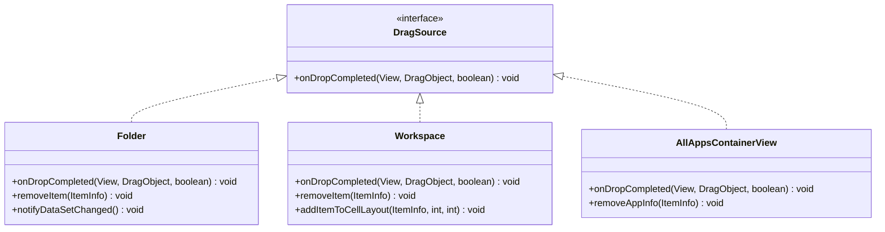
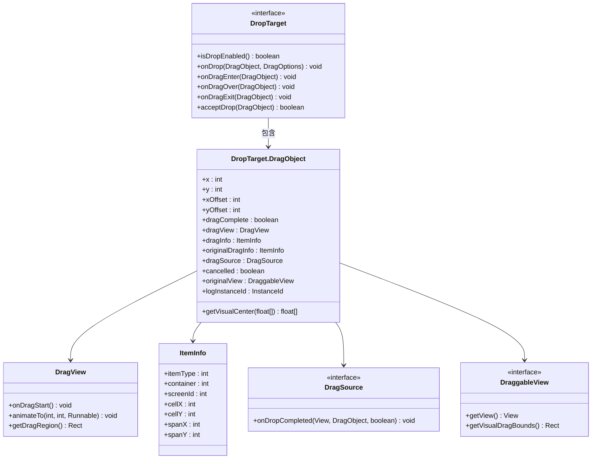
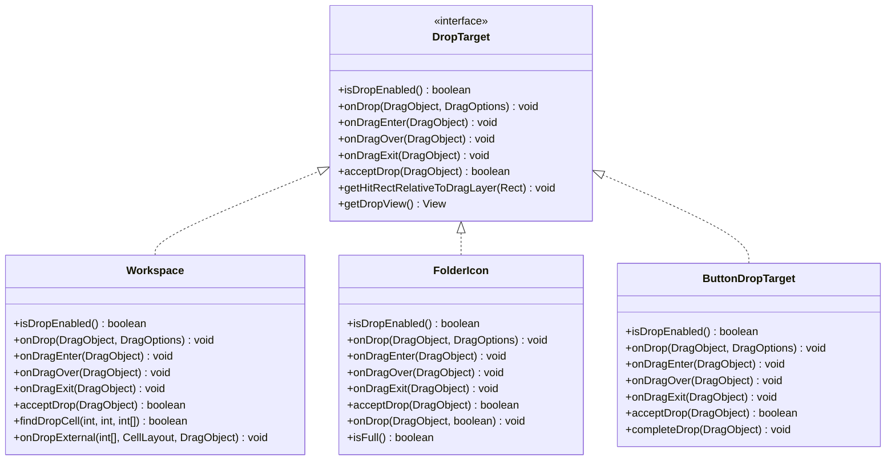
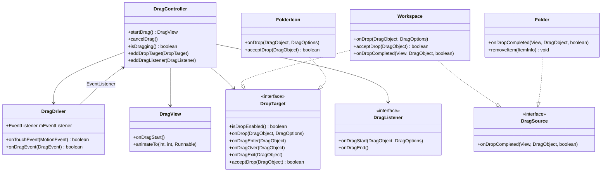
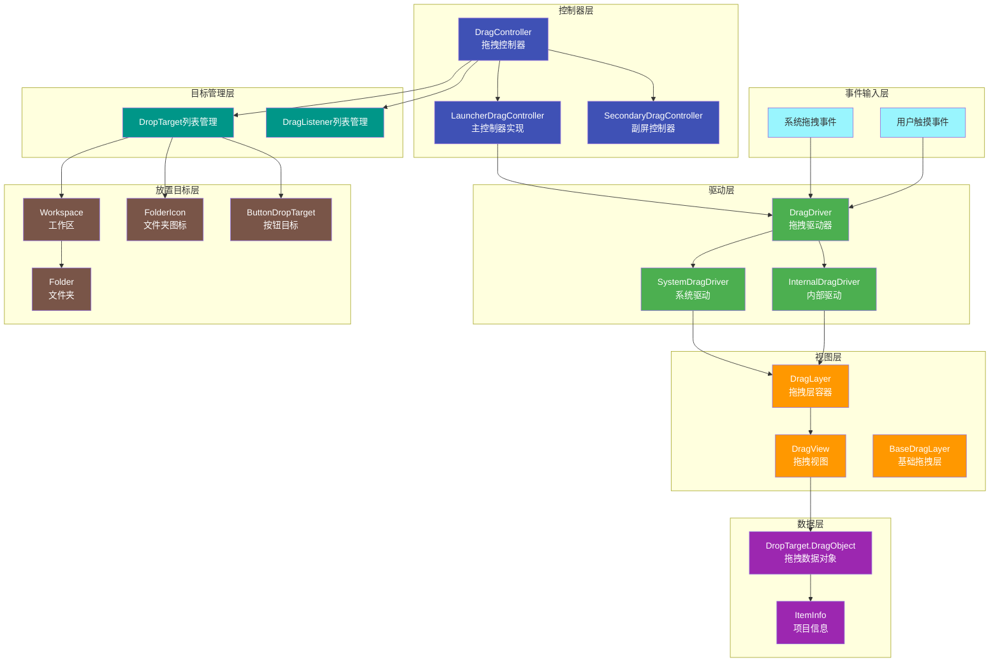
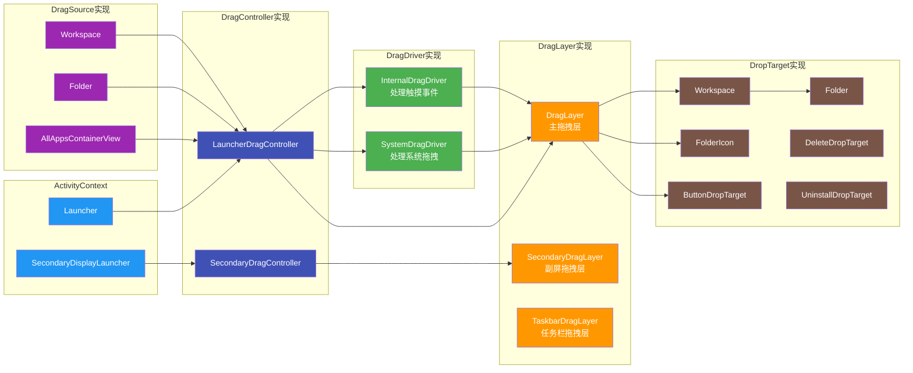
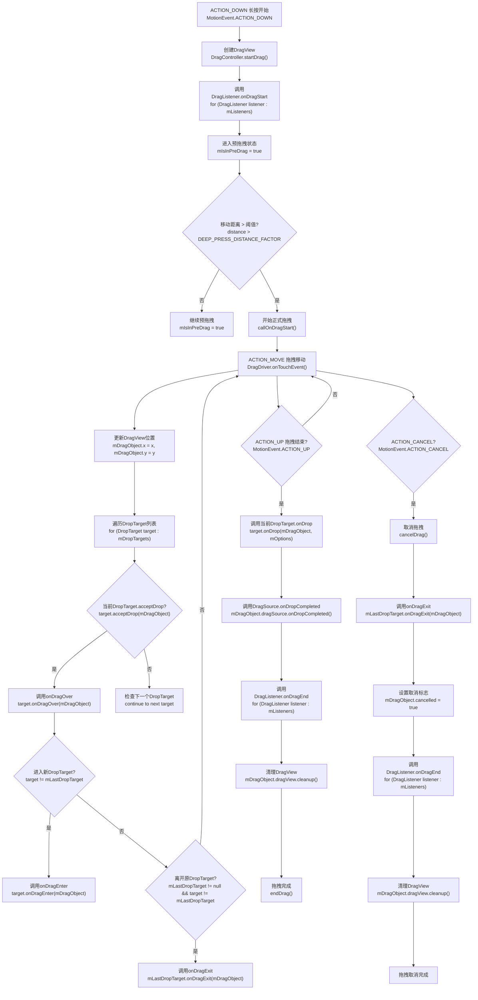
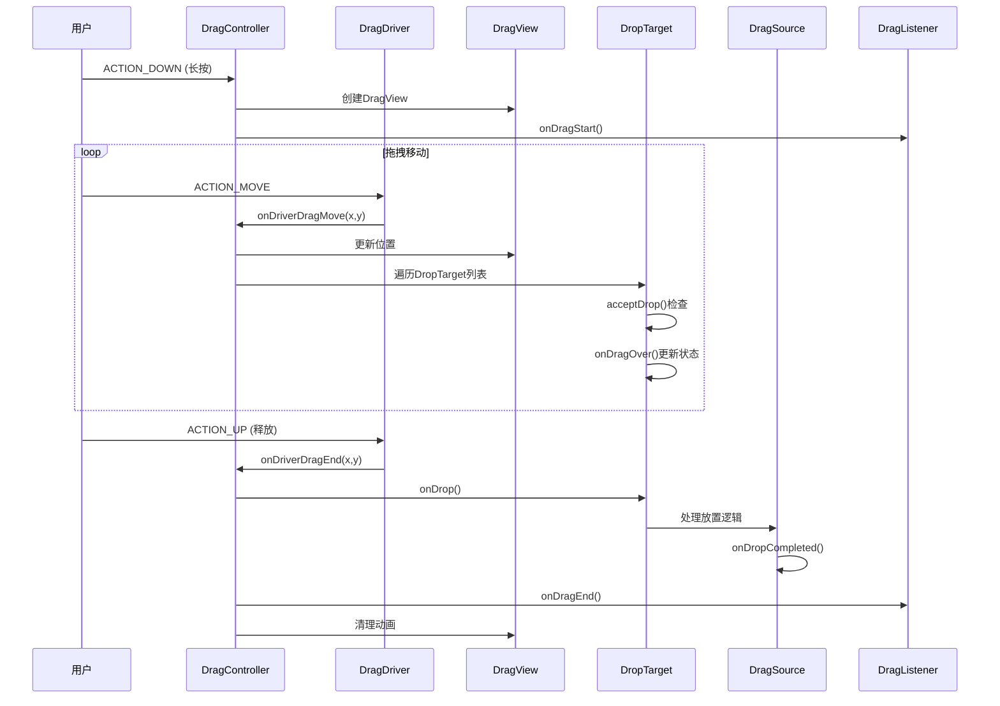

# Launcher3拖拽系统架构分析报告

## 概述

本报告基于对AOSP Launcher3源码的深入分析，全面解析了Launcher3中的拖拽系统架构，包括拖拽控制器、拖拽驱动、拖拽目标等核心组件的设计原理和实现机制。

**源码位置**: 
- DragController: `src/com/android/launcher3/dragndrop/DragController.java`
- DragDriver: `src/com/android/launcher3/dragndrop/DragDriver.java`
- DragView: `src/com/android/launcher3/dragndrop/DragView.java`
- DropTarget: `src/com/android/launcher3/DropTarget.java`
- DragSource: `src/com/android/launcher3/DragSource.java`
- Workspace: `src/com/android/launcher3/Workspace.java`

## 拖拽系统架构分析

### 核心组件架构

Launcher3的拖拽系统采用分层设计，包含控制器层、驱动层、视图层和接口层，实现了高度模块化和可扩展的拖拽功能。

#### 1. DragController - 拖拽控制器

DragController是拖拽系统的核心控制器，负责管理整个拖拽生命周期：
- 管理拖拽开始、移动、结束的完整流程
- 维护DropTarget列表和DragListener列表
- 处理拖拽状态转换和事件分发

```java
public abstract class DragController<T extends ActivityContext>
        implements DragDriver.EventListener, TouchController {
    
    protected DragDriver mDragDriver = null;      // 拖拽驱动器
    public DropTarget.DragObject mDragObject;      // 拖拽对象
    private final ArrayList<DropTarget> mDropTargets = new ArrayList<>();
    private final ArrayList<DragListener> mListeners = new ArrayList<>();
    
    public DragView startDrag(Drawable drawable, DraggableView originalView, ...) {
        // 启动拖拽的核心方法
    }
}
```

#### 2. DragDriver - 拖拽驱动器

DragDriver负责处理具体的触摸和拖拽事件，支持两种实现：
- **InternalDragDriver**: 处理Launcher内部的拖拽事件
- **SystemDragDriver**: 处理系统级的跨应用拖拽事件

```java
public abstract class DragDriver {
    protected final EventListener mEventListener;
    
    public interface EventListener {
        void onDriverDragMove(float x, float y);
        void onDriverDragEnd(float x, float y);
        void onDriverDragCancel();
    }
}
```

#### 3. DragView - 拖拽视图

DragView是拖拽过程中显示的视图组件，负责：
- 显示拖拽项的视觉反馈
- 实现拖拽动画效果
- 管理拖拽过程中的缩放和位置变化

```java
public abstract class DragView<T extends Context & ActivityContext> extends FrameLayout {
    private final View mContent;           // 拖拽内容视图
    private final int mRegistrationX;      // 注册点X坐标
    private final int mRegistrationY;      // 注册点Y坐标
    private final float mInitialScale;      // 初始缩放比例
    
    public void onDragStart() {
        // 拖拽开始时的动画
    }
}
```

### 核心接口设计

#### 1. DropTarget接口 - 拖拽目标

DropTarget定义了拖拽目标对象的行为规范：

```java
public interface DropTarget {
    boolean isDropEnabled();                    // 是否允许拖拽释放
    void onDrop(DragObject dragObject, DragOptions options); // 拖拽结束放开图标
    void onDragEnter(DragObject dragObject);   // 拖拽进入目标视图
    void onDragOver(DragObject dragObject);    // 拖拽在目标视图中经过
    void onDragExit(DragObject dragObject);    // 拖拽退出目标视图
    boolean acceptDrop(DragObject dragObject);  // 目标视图是否可以接受放置
}
```

#### 2. DragSource接口 - 拖拽源

DragSource定义了拖拽源对象的行为规范：

```java
public interface DragSource {
    void onDropCompleted(View target, DragObject d, boolean success);
}
```

#### 3. DragListener接口 - 拖拽监听器

DragListener定义了拖拽开始和结束的监听接口：

```java
public interface DragListener {
    void onDragStart(DropTarget.DragObject dragObject, DragOptions options);
    void onDragEnd();
}
```

### DragObject数据结构

DragObject包含了拖拽过程中的所有数据：

```java
class DragObject {
    public int x = -1;                         // 当前触摸位置X
    public int y = -1;                         // 当前触摸位置Y
    public int xOffset = -1;                   // X偏移量
    public int yOffset = -1;                   // Y偏移量
    public boolean dragComplete = false;       // 拖拽是否完成
    public DragView dragView = null;           // 拖拽视图
    public ItemInfo dragInfo = null;           // 拖拽项信息
    public DragSource dragSource = null;        // 拖拽来源
    public boolean cancelled = false;          // 是否取消
    public DraggableView originalView = null;  // 原始视图
}
```

## 类图分析

### 1. 核心接口类图

#### DragSource接口类图


#### DragObject数据结构类图


#### DropTarget接口类图


### 2. 完整系统类图



## 架构图

### 1. 核心架构层次图



### 2. 详细组件关系图



## 拖拽流程图

### 1. 通用拖拽流程图（含代码细节）



### 2. 从Folder拖拽图标到Workspace的完整流程图（含事件细节）

```mermaid
flowchart TD
    subgraph "事件触发阶段"
        A["用户长按Folder中的图标<br/>onLongClick事件"] --> B["Folder.onLongClick触发<br/>View.OnLongClickListener"]
        B --> C["DragController.startDrag被调用<br/>ItemLongClickListener.onLongClick()"]
    end
    
    subgraph "拖拽初始化阶段"
        C --> D["创建DragView并设置dragSource为Folder<br/>LauncherDragController.startDrag()"]
        D --> E["调用Folder.onDragStart<br/>DragListener.onDragStart()"]
        E --> F["进入拖拽状态<br/>mIsInPreDrag = false"]
    end
    
    subgraph "拖拽移动阶段"
        F --> G["用户拖动图标<br/>ACTION_MOVE事件循环"]
        G --> H["DragDriver处理ACTION_MOVE事件<br/>InternalDragDriver.onTouchEvent()"]
        H --> I["更新DragView位置<br/>mDragObject.x/y更新"]
        I --> J["遍历DropTarget列表<br/>for (DropTarget target : mDropTargets)"]
        
        J --> K{"当前在FolderIcon上?<br/>target instanceof FolderIcon"}
        K -->|是| L["FolderIcon.onDragOver<br/>FolderIcon.onDragOver()<br/>作用: 检查是否可以接受拖拽项<br/>实现: acceptDrop()检查文件夹是否已满"]
        L --> M{"离开FolderIcon?<br/>!isOverFolderIcon()"}
        M -->|是| N["FolderIcon.onDragExit<br/>FolderIcon.onDragExit()<br/>作用: 清理拖拽进入状态<br/>实现: 重置文件夹高亮状态"]
        
        K -->|否| O{"当前在Workspace上?<br/>target instanceof Workspace"}
        O -->|是| P["Workspace.onDragEnter<br/>Workspace.onDragEnter()<br/>作用: 进入工作区拖拽区域<br/>实现: 初始化放置目标状态"]
        P --> Q["Workspace.onDragOver<br/>Workspace.onDragOver()<br/>作用: 在工作区上移动<br/>实现: 计算目标单元格并高亮显示"]
        Q --> R{"找到有效放置位置?<br/>Workspace.findDropCell()<br/>作用: 检查是否可以放置<br/>实现: 验证单元格是否可用"}
        R -->|是| S["显示放置预览<br/>显示目标单元格高亮"]
        R -->|否| T["显示无效放置提示<br/>显示禁止放置图标"]
        S --> U{"用户释放图标?<br/>等待ACTION_UP事件"}
        T --> U
    end
    
    subgraph "拖拽释放阶段"
        U -->|是| V["Workspace.onDrop被调用<br/>ACTION_UP事件触发<br/>作用: DropTarget接口的核心方法<br/>实现: 处理图标放置到工作区的逻辑"]
        V --> W["Workspace.findDropCell计算目标位置<br/>计算目标单元格坐标<br/>作用: 确定放置的目标单元格<br/>实现: 根据坐标计算cellX/cellY"]
        W --> X["Workspace.onDropExternal处理外部放置<br/>处理从Folder到Workspace的放置<br/>作用: 处理从外部拖拽源的放置<br/>实现: 调用外部放置处理逻辑"]
        X --> Y["从Folder中移除图标<br/>Folder.removeItem()<br/>作用: 从文件夹中删除图标<br/>实现: 更新FolderInfo数据模型"]
        Y --> Z["在Workspace目标位置添加图标<br/>Workspace.addInScreen()<br/>作用: 在工作区添加新图标<br/>实现: 创建新的ItemInfo并添加到CellLayout"]
        Z --> AA["Folder.onDropCompleted被调用<br/>DragSource.onDropCompleted()<br/>作用: 通知Folder拖拽完成<br/>实现: 更新文件夹数据并刷新UI"]
        AA --> AB["Folder.removeItem移除数据<br/>从Folder数据模型中删除<br/>作用: 清理文件夹数据<br/>实现: 从contents列表中删除ItemInfo"]
        AB --> AC["Folder.notifyDataSetChanged更新UI<br/>刷新Folder显示<br/>作用: 更新文件夹界面<br/>实现: 调用Adapter.notifyDataSetChanged()"]
        AC --> AD["Workspace.onDropCompleted被调用<br/>DragSource.onDropCompleted()<br/>作用: 通知Workspace拖拽完成<br/>实现: 更新工作区数据模型"]
        AD --> AE["Workspace.addItemToCellLayout添加数据<br/>更新Workspace数据模型<br/>作用: 将图标添加到工作区<br/>实现: 绑定ItemInfo到CellLayout"]
        AE --> AF["调用DragListener.onDragEnd<br/>for (DragListener listener : mListeners)"]
        AF --> AG["清理DragView动画<br/>DragView.cleanup()"]
        AG --> AH["拖拽完成<br/>endDrag()"]
    end
    
    O -->|否| AI{"在其他DropTarget上?<br/>其他DropTarget处理"}
     AI -->|是| AJ["相应DropTarget的处理<br/>如DeleteDropTarget等"]
     
     %% 异常处理分支
     G --> AK{"拖拽取消?<br/>ACTION_CANCEL事件"}
     AK -->|是| AL["取消拖拽流程<br/>cancelDrag()"]
     AL --> AM["恢复图标到Folder<br/>不进行数据变更"]
     AM --> AN["清理DragView<br/>DragView.cleanup()"]
     AN --> AO["拖拽取消完成"]
```



## 时序图



## DropTarget实现类分析

### 1. Workspace - 桌面工作区

Workspace是主要的DropTarget实现，负责：
- 图标重排和位置交换
- 文件夹创建和管理
- 支持外部拖拽（从All Apps拖入）

关键方法：
```java
@Override
public boolean acceptDrop(DragObject d) {
    // 检查是否在有效的放置目标上
    CellLayout dropTargetLayout = mDropToLayout;
    if (d.dragSource != this) {
        // 外部拖拽的特殊处理
        if (dropTargetLayout == null) return false;
    }
    return true;
}

@Override
public void onDrop(final DragObject d, DragOptions options) {
    // 处理放置逻辑
    mDragViewVisualCenter = d.getVisualCenter(mDragViewVisualCenter);
    // 具体的放置实现...
}
```

### 2. FolderIcon - 文件夹图标

FolderIcon实现DropTarget接口，支持：
- 图标拖入文件夹
- 图标从文件夹拖出
- 文件夹内图标重排

### 3. ButtonDropTarget - 按钮式放置目标

ButtonDropTarget是抽象基类，具体实现包括：
- **DeleteDropTarget**: 删除操作
- **UninstallDropTarget**: 卸载操作
- **InfoDropTarget**: 应用信息

## 设计模式应用

### 1. 观察者模式
DragController管理多个DragListener，实现拖拽事件的广播通知。

### 2. 策略模式
不同的DragDriver实现（InternalDragDriver、SystemDragDriver）提供不同的拖拽策略。

### 3. 适配器模式
DropTarget接口适配不同的视图组件（Workspace、FolderIcon等）。

### 4. 工厂模式
DragDriver.create()方法根据条件创建不同的驱动实例。

## DropTarget和DragSource接口方法代码分析

### 1. Workspace中DropTarget接口方法实现分析

#### acceptDrop方法 - 检查是否接受拖拽项
```java
@Override
public boolean acceptDrop(DragObject d) {
    // 如果是外部拖拽（如从All Apps），检查是否应该接受
    CellLayout dropTargetLayout = mDropToLayout;
    if (d.dragSource != this) {
        // 如果在放置时没有在有效的放置目标上，不接受放置
        if (dropTargetLayout == null) {
            return false;
        }
        if (!transitionStateShouldAllowDrop()) return false;
        // 如果无法处理payload，拒绝系统级放置
        // ... 具体检查逻辑
    }
    return true;
}
```

**代码分析**:
- 区分内部拖拽和外部拖拽，外部拖拽需要额外验证
- 检查当前是否有有效的放置目标布局（mDropToLayout）
- 验证过渡状态是否允许放置（transitionStateShouldAllowDrop）
- 对系统级拖拽进行payload兼容性检查

#### onDrop方法 - 处理放置操作
```java
@Override
public void onDrop(final DragObject d, DragOptions options) {
    mDragViewVisualCenter = d.getVisualCenter(mDragViewVisualCenter);
    CellLayout dropTargetLayout = mDropToLayout;

    // 将点映射到拖拽目标
    if (dropTargetLayout != null) {
        mapPointFromDropLayout(dropTargetLayout, mDragViewVisualCenter);
    }

    if (d.dragSource != this || mDragInfo == null) {
        // 外部放置处理
        final int[] touchXY = new int[]{(int) mDragViewVisualCenter[0],
                (int) mDragViewVisualCenter[1]};
        onDropExternal(touchXY, dropTargetLayout, d);
    } else {
        // 内部放置处理
        // 计算目标单元格、处理文件夹创建、添加等逻辑
        // ... 详细实现
    }
}
```

**代码分析**:
- 获取拖拽视图的视觉中心坐标
- 将坐标映射到目标布局的坐标系
- 区分内部拖拽和外部拖拽，分别处理
- 内部拖拽处理包括：单元格计算、文件夹创建、图标重排等

#### onDragEnter方法 - 进入拖拽区域
```java
@Override
public void onDragEnter(DragObject d) {
    mCreateUserFolderOnDrop = false;
    mAddToExistingFolderOnDrop = false;
    mDropToLayout = null;
    mDragViewVisualCenter = d.getVisualCenter(mDragViewVisualCenter);
    setDropLayoutForDragObject(d, mDragViewVisualCenter[0], mDragViewVisualCenter[1]);
}
```

**代码分析**:
- 重置文件夹创建和添加标志
- 初始化放置目标布局
- 设置拖拽对象的放置布局

### 2. FolderIcon中DropTarget接口方法实现分析

#### acceptDrop方法 - 检查文件夹是否接受拖拽项
```java
public boolean acceptDrop(ItemInfo dragInfo) {
    return !mFolder.isDestroyed() && willAcceptItem(dragInfo);
}
```

**代码分析**:
- 检查文件夹是否已被销毁
- 调用willAcceptItem方法检查具体项目类型是否可接受
- 支持的应用类型包括：快捷方式、小部件、应用对等

#### onDragEnter方法 - 进入文件夹图标拖拽区域
```java
public void onDragEnter(ItemInfo dragInfo) {
    if (mFolder.isDestroyed() || !willAcceptItem(dragInfo)) return;
    CellLayoutLayoutParams lp = (CellLayoutLayoutParams) getLayoutParams();
    CellLayout cl = (CellLayout) getParent().getParent();

    mBackground.animateToAccept(cl, lp.getCellX(), lp.getCellY());
    mOpenAlarm.setOnAlarmListener(mOnOpenListener);
    // 设置弹簧加载定时器
    if (SPRING_LOADING_ENABLED && willAcceptItem(dragInfo)) {
        mOpenAlarm.setAlarm(OPEN_DELAY);
    }
}
```

**代码分析**:
- 验证文件夹状态和项目可接受性
- 获取布局参数和父级CellLayout
- 背景动画显示接受状态
- 设置打开定时器，实现弹簧加载效果

#### onDrop方法 - 处理放置到文件夹
```java
public void onDrop(DragObject d, boolean itemReturnedOnFailedDrop) {
    ItemInfo item;
    if (d.dragInfo instanceof WorkspaceItemFactory) {
        // 来自All Apps - 创建副本
        item = ((WorkspaceItemFactory) d.dragInfo).makeWorkspaceItem(getContext());
    } else if (d.dragSource instanceof BaseItemDragListener){
        // 来自不同窗口 - 创建副本
        item = new AppInfo((AppInfo) d.dragInfo);
    } else {
        // 来自同一窗口 - 使用原始项目
        item = d.dragInfo;
    }
    
    // 添加到文件夹的具体逻辑
    mFolder.addItem(item);
}
```

**代码分析**:
- 根据拖拽源类型创建适当的项目实例
- 处理来自不同源的拖拽项目
- 调用文件夹的addItem方法添加项目

### 3. DragSource接口方法实现分析

#### Folder中onDropCompleted方法
```java
@Override
public void onDropCompleted(final View target, final DragObject d,
        final boolean success) {
    if (success) {
        if (getItemCount() <= 1) {
            mDeleteFolderOnDropCompleted = true;
        }
        if (mDeleteFolderOnDropCompleted && !mItemAddedBackToSelfViaIcon
                && target != this) {
            replaceFolderWithFinalItem();
        }
    } else {
        // 拖拽失败，需要将项目返回到文件夹
        ItemInfo info = d.dragInfo;
        View icon = (mCurrentDragView != null && mCurrentDragView.getTag() == info)
                ? mCurrentDragView : mContent.createNewView(info);
        // 恢复项目到文件夹
        mContent.addView(icon);
    }
}
```

**代码分析**:
- 成功放置时检查是否需要删除文件夹（当项目数<=1时）
- 如果拖拽失败，恢复项目到文件夹中
- 处理文件夹的自动删除和项目恢复逻辑

#### Workspace中onDropCompleted方法
```java
public void onDropCompleted(final View target, final DragObject d,
                            final boolean success) {
    if (success) {
        if (target != this && mDragInfo != null) {
            removeWorkspaceItem(mDragInfo.cell);
        }
    } else if (mDragInfo != null) {
        // 拖拽取消时，将内容视图重新附加到原始父级
        if (mDragInfo.cell instanceof LauncherAppWidgetHostView && d.dragView != null) {
            d.dragView.detachContentView(/* reattachToPreviousParent= */ true);
        }
        final CellLayout cellLayout = mLauncher.getCellLayout(
                mDragInfo.container, mDragInfo.screenId);
        if (cellLayout != null) {
            cellLayout.onDropChild(mDragInfo.cell);
        }
    }
    mDragInfo = null;
}
```

**代码分析**:
- 成功放置时从工作区移除原始项目
- 拖拽取消时恢复小部件内容视图
- 清理拖拽信息，重置状态

### 4. 关键设计模式应用分析

#### 策略模式在DropTarget中的应用
每个DropTarget实现类根据自身特性实现不同的放置策略：
- **Workspace**: 处理单元格布局和图标重排
- **FolderIcon**: 处理文件夹添加和弹簧加载
- **DeleteDropTarget**: 处理删除操作

#### 观察者模式在DragSource中的应用
DragSource接口允许不同的拖拽源（Folder、Workspace等）在拖拽完成后执行特定的清理和更新操作。

#### 模板方法模式在拖拽流程中的应用
DragController定义了拖拽的标准流程，而具体的DropTarget和DragSource实现提供特定于组件的实现。

## 性能优化特性

### 1. 延迟清理机制
通过`deferDragViewCleanupPostAnimation`标志，支持动画完成后才清理DragView，避免动画中断。

### 2. 视觉中心计算
`getVisualCenter()`方法提供精确的放置位置计算，提升用户体验。

### 3. 动画优化
使用插值器和动画监听实现流畅的拖拽体验，支持弹簧动画效果。

### 4. 内存管理
使用临时变量和对象池避免GC压力，提高性能。

## 总结

Launcher3的拖拽系统设计精良，具有以下特点：

1. **分层架构清晰**: 控制器层、驱动层、视图层职责分明
2. **接口设计灵活**: 通过接口实现高度可扩展性
3. **状态管理完善**: 预拖拽、正式拖拽、放置状态有序转换
4. **性能优化到位**: 延迟清理、视觉中心计算等优化措施
5. **用户体验流畅**: 支持流畅的拖拽动画和视觉效果

这套拖拽系统为Android Launcher提供了强大而灵活的拖拽功能，是Android系统交互体验的重要组成部分。