# Launcher手势动画分析

## 1. 核心文件分析

### 1.1 主要手势控制器

| 控制器类 | 职责 | 文件路径 |
|---------|------|----------|
| `AbsSwipeUpHandler` | 处理导航手势的核心类 | `quickstep/src/com/android/quickstep/AbsSwipeUpHandler.java` |
| `PortraitStatesTouchController` | 处理竖屏模式下的状态转换手势 | `quickstep/src/com/android/launcher3/uioverrides/touchcontrollers/PortraitStatesTouchController.java` |
| `TwoButtonNavbarTouchController` | 处理双按钮导航模式下的边缘滑动 | `quickstep/src/com/android/launcher3/uioverrides/touchcontrollers/TwoButtonNavbarTouchController.java` |
| `EdgeBackGestureHandler` | 处理侧滑返回手势 | `quickstep/src/com/android/quickstep/interaction/EdgeBackGestureHandler.java` |
| `AbstractStateChangeTouchController` | 状态变化触摸控制器基类 | `quickstep/src/com/android/launcher3/touch/AbstractStateChangeTouchController.java` |

### 1.2 动画相关类

| 类名 | 职责 | 文件路径 |
|------|------|----------|
| `AnimatorPlaybackController` | 控制动画播放 | `src/com/android/launcher3/anim/AnimatorPlaybackController.java` |
| `SwipeUpAnimationLogic` | 处理上滑动画逻辑 | `quickstep/src/com/android/quickstep/SwipeUpAnimationLogic.java` |
| `SingleAxisSwipeDetector` | 单轴滑动检测器 | `src/com/android/launcher3/touch/SingleAxisSwipeDetector.java` |

## 2. 手势处理流程

### 2.1 触摸事件分发流程

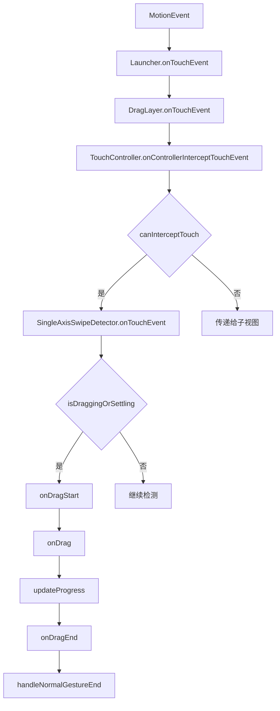
```mermaid
graph TD
    A[MotionEvent] --> B[Launcher.onTouchEvent]
    B --> C[DragLayer.onTouchEvent]
    C --> D[TouchController.onControllerInterceptTouchEvent]
    D --> E{canInterceptTouch}
    E -->|是| F[SingleAxisSwipeDetector.onTouchEvent]
    E -->|否| G[传递给子视图]
    F --> H{isDraggingOrSettling}
    H -->|是| I[onDragStart]
    H -->|否| J[继续检测]
    I --> K[onDrag]
    K --> L[updateProgress]
    L --> M[onDragEnd]
    M --> N[handleNormalGestureEnd]
```

### 2.2 上滑手势调用链

#### 2.2.1 ACTION_DOWN 事件链

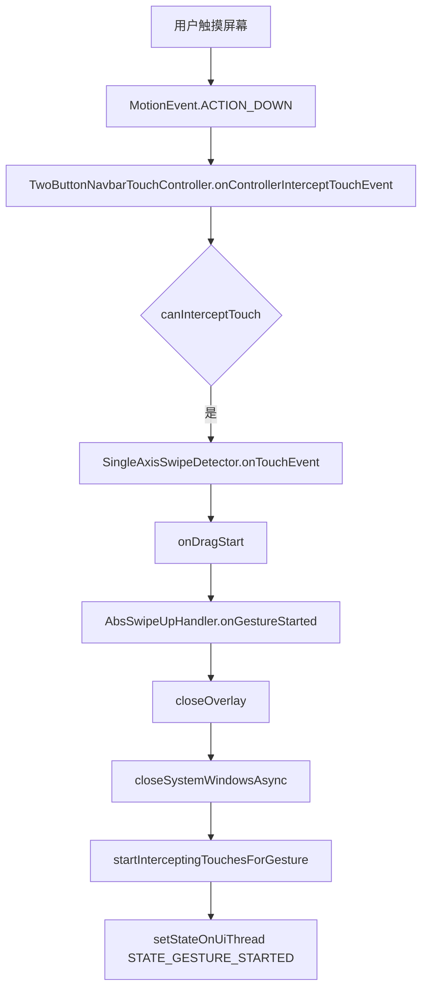
```mermaid
graph TD
    A[用户触摸屏幕] --> B[MotionEvent.ACTION_DOWN]
    B --> C[TwoButtonNavbarTouchController.onControllerInterceptTouchEvent]
    C --> D{canInterceptTouch}
    D -->|是| E[SingleAxisSwipeDetector.onTouchEvent]
    E --> F[onDragStart]
    F --> G[AbsSwipeUpHandler.onGestureStarted]
    G --> H[closeOverlay]
    H --> I[closeSystemWindowsAsync]
    I --> J[startInterceptingTouchesForGesture]
    J --> K[setStateOnUiThread STATE_GESTURE_STARTED]
```

#### 2.2.2 ACTION_MOVE 事件链

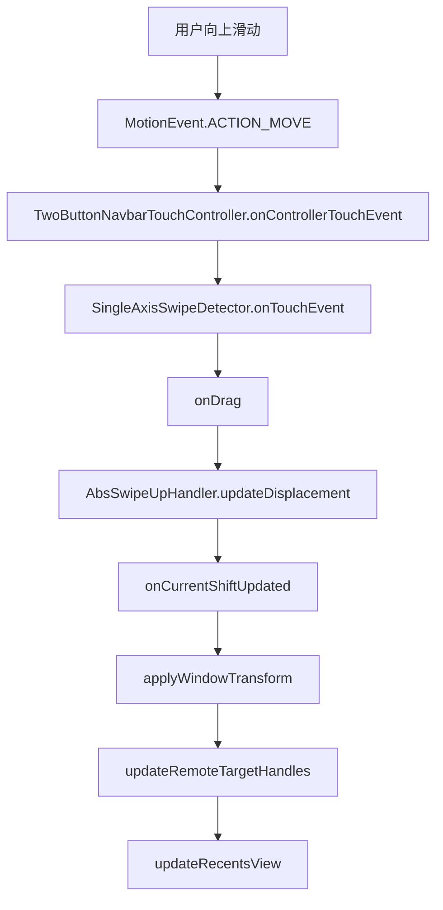
```mermaid
graph TD
    A[用户向上滑动] --> B[MotionEvent.ACTION_MOVE]
    B --> C[TwoButtonNavbarTouchController.onControllerTouchEvent]
    C --> D[SingleAxisSwipeDetector.onTouchEvent]
    D --> E[onDrag]
    E --> F[AbsSwipeUpHandler.updateDisplacement]
    F --> G[onCurrentShiftUpdated]
    G --> H[applyWindowTransform]
    H --> I[updateRemoteTargetHandles]
    I --> J[updateRecentsView]
```

#### 2.2.3 ACTION_UP 事件链

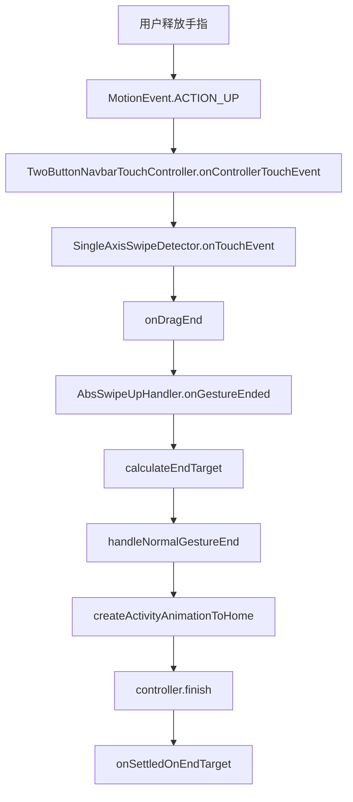
```mermaid
graph TD
    A[用户释放手指] --> B[MotionEvent.ACTION_UP]
    B --> C[TwoButtonNavbarTouchController.onControllerTouchEvent]
    C --> D[SingleAxisSwipeDetector.onTouchEvent]
    D --> E[onDragEnd]
    E --> F[AbsSwipeUpHandler.onGestureEnded]
    F --> G[calculateEndTarget]
    G --> H[handleNormalGestureEnd]
    H --> I[createActivityAnimationToHome]
    I --> J[controller.finish]
    J --> K[onSettledOnEndTarget]
```

### 2.3 下滑手势调用链

#### 2.3.1 ACTION_DOWN 事件链

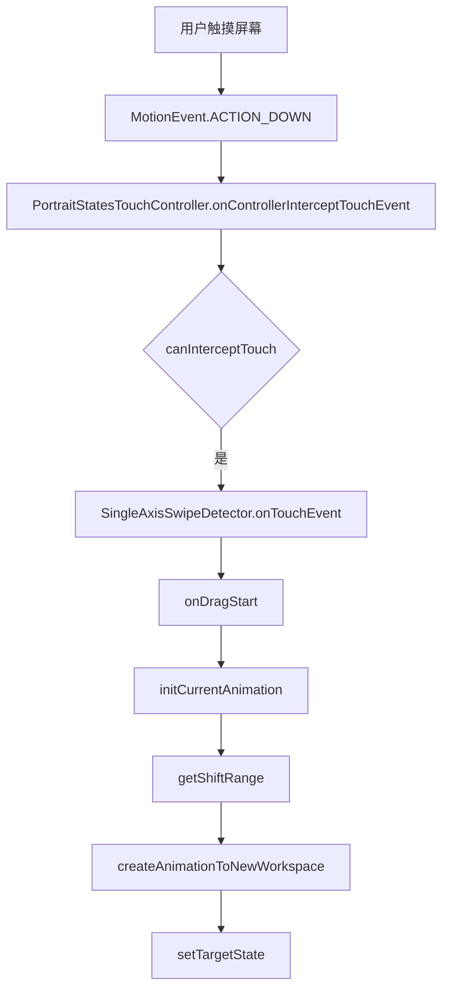
```mermaid
graph TD
    A[用户触摸屏幕] --> B[MotionEvent.ACTION_DOWN]
    B --> C[PortraitStatesTouchController.onControllerInterceptTouchEvent]
    C --> D{canInterceptTouch}
    D -->|是| E[SingleAxisSwipeDetector.onTouchEvent]
    E --> F[onDragStart]
    F --> G[initCurrentAnimation]
    G --> H[getShiftRange]
    H --> I[createAnimationToNewWorkspace]
    I --> J[setTargetState]
```

#### 2.3.2 ACTION_MOVE 事件链

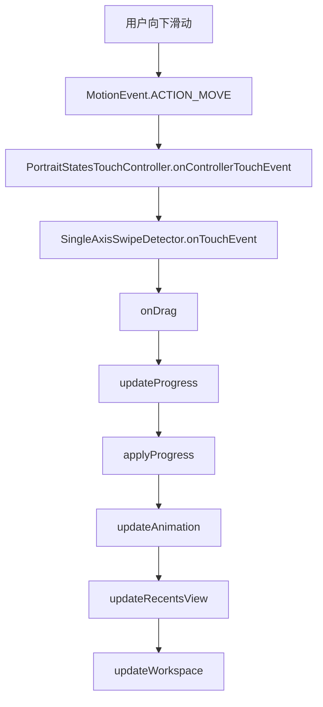
```mermaid
graph TD
    A[用户向下滑动] --> B[MotionEvent.ACTION_MOVE]
    B --> C[PortraitStatesTouchController.onControllerTouchEvent]
    C --> D[SingleAxisSwipeDetector.onTouchEvent]
    D --> E[onDrag]
    E --> F[updateProgress]
    F --> G[applyProgress]
    G --> H[updateAnimation]
    H --> I[updateRecentsView]
    I --> J[updateWorkspace]
```

#### 2.3.3 ACTION_UP 事件链

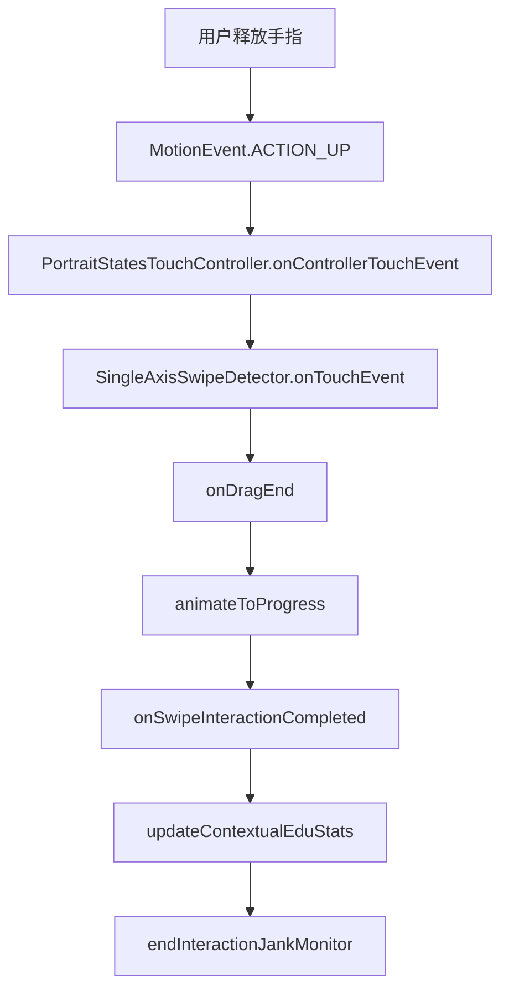
```mermaid
graph TD
    A[用户释放手指] --> B[MotionEvent.ACTION_UP]
    B --> C[PortraitStatesTouchController.onControllerTouchEvent]
    C --> D[SingleAxisSwipeDetector.onTouchEvent]
    D --> E[onDragEnd]
    E --> F[animateToProgress]
    F --> G[onSwipeInteractionCompleted]
    G --> H[updateContextualEduStats]
    H --> I[endInteractionJankMonitor]
```

### 2.4 侧滑返回手势调用链

#### 2.4.1 ACTION_DOWN 事件链

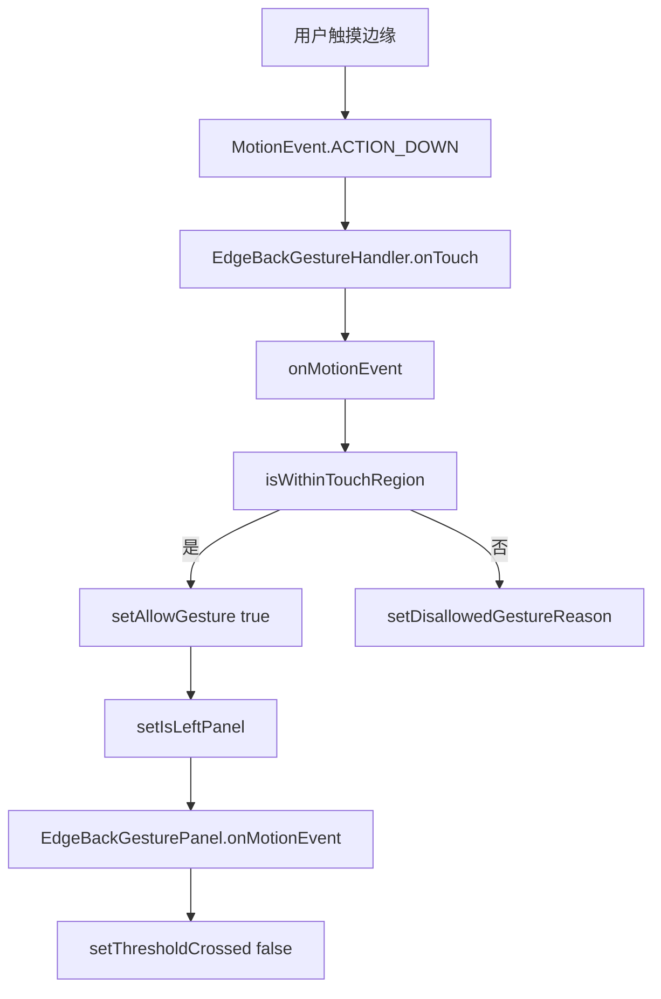
```mermaid
graph TD
    A[用户触摸边缘] --> B[MotionEvent.ACTION_DOWN]
    B --> C[EdgeBackGestureHandler.onTouch]
    C --> D[onMotionEvent]
    D --> E[isWithinTouchRegion]
    E -->|是| F[setAllowGesture true]
    F --> G[setIsLeftPanel]
    G --> H[EdgeBackGesturePanel.onMotionEvent]
    H --> I[setThresholdCrossed false]
    E -->|否| J[setDisallowedGestureReason]
```

#### 2.4.2 ACTION_MOVE 事件链

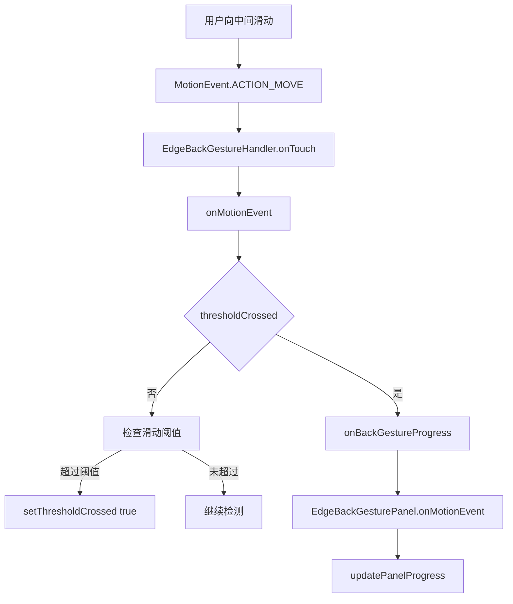
```mermaid
graph TD
    A[用户向中间滑动] --> B[MotionEvent.ACTION_MOVE]
    B --> C[EdgeBackGestureHandler.onTouch]
    C --> D[onMotionEvent]
    D --> E{thresholdCrossed}
    E -->|否| F[检查滑动阈值]
    F -->|超过阈值| G[setThresholdCrossed true]
    F -->|未超过| H[继续检测]
    E -->|是| I[onBackGestureProgress]
    I --> J[EdgeBackGesturePanel.onMotionEvent]
    J --> K[updatePanelProgress]
```

#### 2.4.3 ACTION_UP 事件链

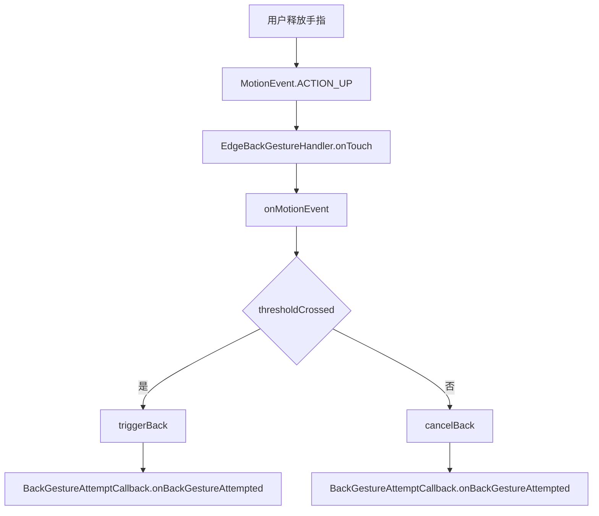
```mermaid
graph TD
    A[用户释放手指] --> B[MotionEvent.ACTION_UP]
    B --> C[EdgeBackGestureHandler.onTouch]
    C --> D[onMotionEvent]
    D --> E{thresholdCrossed}
    E -->|是| F[triggerBack]
    F --> G[BackGestureAttemptCallback.onBackGestureAttempted]
    E -->|否| H[cancelBack]
    H --> I[BackGestureAttemptCallback.onBackGestureAttempted]
```

## 3. 动画执行时序图

### 3.1 上滑手势动画时序

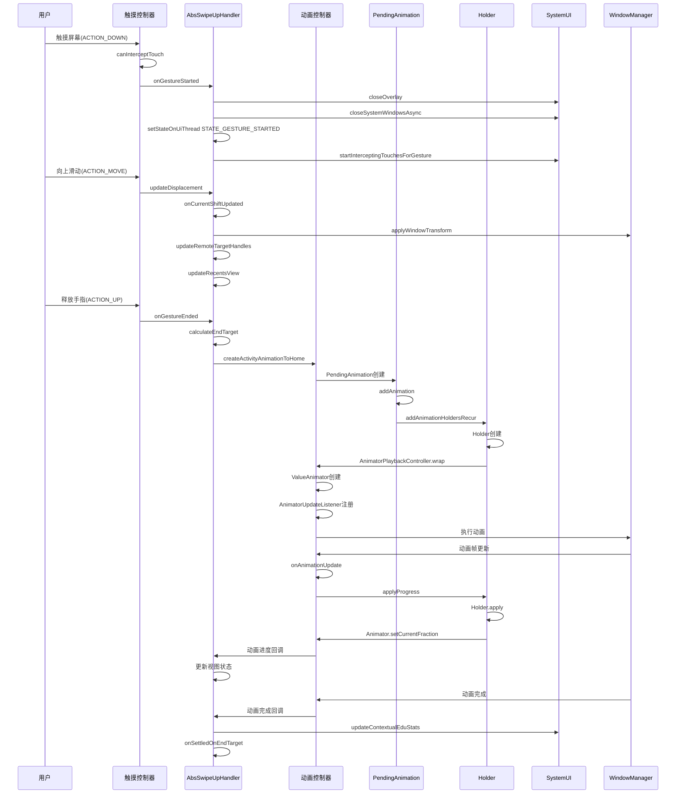
```mermaid
sequenceDiagram
    participant User as 用户
    participant Touch as 触摸控制器
    participant Handler as AbsSwipeUpHandler
    participant Animator as 动画控制器
    participant PendingAnim as PendingAnimation
    participant Holder as Holder
    participant SystemUI as SystemUI
    participant WindowManager as WindowManager

    %% ACTION_DOWN 阶段
    User->>Touch: 触摸屏幕(ACTION_DOWN)
    Touch->>Touch: canInterceptTouch
    Touch->>Handler: onGestureStarted
    Handler->>SystemUI: closeOverlay
    Handler->>SystemUI: closeSystemWindowsAsync
    Handler->>Handler: setStateOnUiThread STATE_GESTURE_STARTED
    Handler->>SystemUI: startInterceptingTouchesForGesture

    %% ACTION_MOVE 阶段
    User->>Touch: 向上滑动(ACTION_MOVE)
    Touch->>Handler: updateDisplacement
    Handler->>Handler: onCurrentShiftUpdated
    Handler->>WindowManager: applyWindowTransform
    Handler->>Handler: updateRemoteTargetHandles
    Handler->>Handler: updateRecentsView

    %% ACTION_UP 阶段
    User->>Touch: 释放手指(ACTION_UP)
    Touch->>Handler: onGestureEnded
    Handler->>Handler: calculateEndTarget
    
    %% 动画控制器创建
    Handler->>Animator: createActivityAnimationToHome
    Animator->>PendingAnim: PendingAnimation创建
    PendingAnim->>PendingAnim: addAnimation
    PendingAnim->>Holder: addAnimationHoldersRecur
    Holder->>Holder: Holder创建
    Holder->>Animator: AnimatorPlaybackController.wrap
    Animator->>Animator: ValueAnimator创建
    Animator->>Animator: AnimatorUpdateListener注册
    
    %% 动画执行
    Animator->>WindowManager: 执行动画
    WindowManager->>Animator: 动画帧更新
    Animator->>Animator: onAnimationUpdate
    Animator->>Holder: applyProgress
    Holder->>Holder: Holder.apply
    Holder->>Animator: Animator.setCurrentFraction
    Animator->>Handler: 动画进度回调
    Handler->>Handler: 更新视图状态
    
    %% 动画完成
    WindowManager->>Animator: 动画完成
    Animator->>Handler: 动画完成回调
    Handler->>SystemUI: updateContextualEduStats
    Handler->>Handler: onSettledOnEndTarget
```

### 3.2 下滑返回应用时序

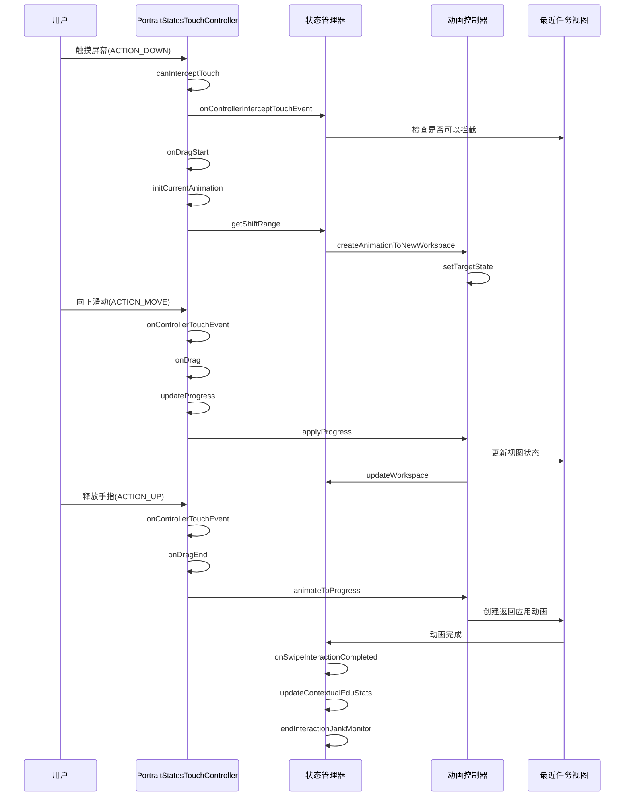
```mermaid
sequenceDiagram
    participant User as 用户
    participant Touch as PortraitStatesTouchController
    participant Handler as 状态管理器
    participant Animator as 动画控制器
    participant RecentsView as 最近任务视图

    %% ACTION_DOWN 阶段
    User->>Touch: 触摸屏幕(ACTION_DOWN)
    Touch->>Touch: canInterceptTouch
    Touch->>Handler: onControllerInterceptTouchEvent
    Handler->>RecentsView: 检查是否可以拦截
    Touch->>Touch: onDragStart
    Touch->>Touch: initCurrentAnimation
    Touch->>Handler: getShiftRange
    Handler->>Animator: createAnimationToNewWorkspace
    Animator->>Animator: setTargetState

    %% ACTION_MOVE 阶段
    User->>Touch: 向下滑动(ACTION_MOVE)
    Touch->>Touch: onControllerTouchEvent
    Touch->>Touch: onDrag
    Touch->>Touch: updateProgress
    Touch->>Animator: applyProgress
    Animator->>RecentsView: 更新视图状态
    Animator->>Handler: updateWorkspace

    %% ACTION_UP 阶段
    User->>Touch: 释放手指(ACTION_UP)
    Touch->>Touch: onControllerTouchEvent
    Touch->>Touch: onDragEnd
    Touch->>Animator: animateToProgress
    Animator->>RecentsView: 创建返回应用动画
    RecentsView->>Handler: 动画完成
    Handler->>Handler: onSwipeInteractionCompleted
    Handler->>Handler: updateContextualEduStats
    Handler->>Handler: endInteractionJankMonitor
```

## 4. 核心方法分析

### 4.1 `AbsSwipeUpHandler.onGestureStarted`

**功能**：处理手势开始时的逻辑

**关键代码**：
```java
@UiThread
public void onGestureStarted(boolean isLikelyToStartNewTask) {
    mContainerInterface.closeOverlay();
    TaskUtils.closeSystemWindowsAsync(CLOSE_SYSTEM_WINDOWS_REASON_RECENTS);

    if (mRecentsView != null) {
        final View rv = mRecentsView;
        mRecentsView.getViewTreeObserver().addOnDrawListener(new OnDrawListener() {
            boolean mHandled = false;

            @Override
            public void onDraw() {
                if (mHandled) {
                    return;
                }
                mHandled = true;

                InteractionJankMonitorWrapper.begin(mRecentsView, Cuj.CUJ_LAUNCHER_QUICK_SWITCH,
                        2000 /* ms timeout */);
                InteractionJankMonitorWrapper.begin(mRecentsView,
                        Cuj.CUJ_LAUNCHER_APP_CLOSE_TO_HOME);
                InteractionJankMonitorWrapper.begin(mRecentsView,
                        Cuj.CUJ_LAUNCHER_APP_SWIPE_TO_RECENTS);

                rv.post(() -> rv.getViewTreeObserver().removeOnDrawListener(this));
            }
        });
    }
    notifyGestureStarted();
    setIsLikelyToStartNewTask(isLikelyToStartNewTask, false /* animate */);

    if (mIsTransientTaskbar && !mTaskbarAlreadyOpen && !isLikelyToStartNewTask) {
        setClampScrollOffset(true);
    }
    mStateCallback.setStateOnUiThread(STATE_GESTURE_STARTED);
    mGestureStarted = true;
}
```

### 4.2 `AbstractStateChangeTouchController.onControllerInterceptTouchEvent`

**功能**：拦截触摸事件的核心方法

**关键代码**：
```java
@Override
public boolean onControllerInterceptTouchEvent(MotionEvent ev) {
    if (ev.getAction() == MotionEvent.ACTION_DOWN) {
        mNoIntercept = !canInterceptTouch(ev);
        if (mNoIntercept) {
            return false;
        }

        mIsTrackpadReverseScroll = !mLauncher.isNaturalScrollingEnabled()
                && isTrackpadScroll(ev);

        // Now figure out which direction scroll events the controller will start
        // calling the callbacks.
        final int directionsToDetectScroll;
        boolean ignoreSlopWhenSettling = false;

        if (mCurrentAnimation != null) {
            directionsToDetectScroll = SingleAxisSwipeDetector.DIRECTION_BOTH;
            ignoreSlopWhenSettling = true;
        } else {
            directionsToDetectScroll = getSwipeDirection();
            boolean ignoreMouseScroll = ev.getSource() == InputDevice.SOURCE_MOUSE
                    && enableMouseInteractionChanges();
            if (directionsToDetectScroll == 0 || ignoreMouseScroll) {
                mNoIntercept = true;
                return false;
            }
        }
        mDetector.setDetectableScrollConditions(
                directionsToDetectScroll, ignoreSlopWhenSettling);
    }

    if (mNoIntercept) {
        return false;
    }

    onControllerTouchEvent(ev);
    return mDetector.isDraggingOrSettling();
}
```

### 4.3 `EdgeBackGestureHandler.onMotionEvent`

**功能**：处理侧滑返回手势的触摸事件

**关键代码**：
```java
private void onMotionEvent(MotionEvent ev) {
    int action = ev.getActionMasked();
    if (action == MotionEvent.ACTION_DOWN) {
        boolean isOnLeftEdge = ev.getX() <= mEdgeWidth + mLeftInset;
        mDisallowedGestureReason = BackGestureResult.UNKNOWN;
        mAllowGesture = isWithinTouchRegion((int) ev.getX(), (int) ev.getY());
        mDownPoint.set(ev.getX(), ev.getY());
        if (mAllowGesture) {
            mEdgeBackPanel.setIsLeftPanel(isOnLeftEdge);
            mEdgeBackPanel.onMotionEvent(ev);
            mThresholdCrossed = false;
        }
    } else if (mAllowGesture) {
        if (!mThresholdCrossed) {
            if (action == MotionEvent.ACTION_POINTER_DOWN) {
                // We do not support multi touch for back gesture
                cancelGesture(ev);
                return;
            } else if (action == MotionEvent.ACTION_MOVE) {
                if ((ev.getEventTime() - ev.getDownTime()) > mLongPressTimeout) {
                    cancelGesture(ev);
                    return;
                }
                float dx = Math.abs(ev.getX() - mDownPoint.x);
                float dy = Math.abs(ev.getY() - mDownPoint.y);
                if (dy > dx && dy > mTouchSlop) {
                    cancelGesture(ev);
                    return;
                } else if (dx > dy && dx > mTouchSlop) {
                    mThresholdCrossed = true;
                }
            }
        }

        mGestureCallback.onBackGestureProgress(ev.getX() - mDownPoint.x,
                ev.getY() - mDownPoint.y, mEdgeBackPanel.getIsLeftPanel());

        // forward touch
        mEdgeBackPanel.onMotionEvent(ev);
    }

    if (action == MotionEvent.ACTION_UP || action == MotionEvent.ACTION_CANCEL) {
        float dx = Math.abs(ev.getX() - mDownPoint.x);
        float dy = Math.abs(ev.getY() - mDownPoint.y);
        if (dx > dy && dx > mTouchSlop && !mAllowGesture && mGestureCallback != null) {
            mGestureCallback.onBackGestureAttempted(mDisallowedGestureReason);
        }
    }
}
```

## 4. 动画实现机制

### 4.1 动画控制器创建流程

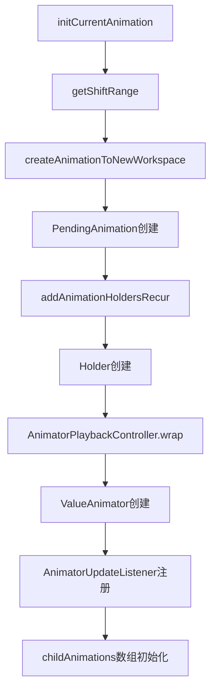
```mermaid
graph TD
    A[initCurrentAnimation] --> B[getShiftRange]
    B --> C[createAnimationToNewWorkspace]
    C --> D[PendingAnimation创建]
    D --> E[addAnimationHoldersRecur]
    E --> F[Holder创建]
    F --> G[AnimatorPlaybackController.wrap]
    G --> H[ValueAnimator创建]
    H --> I[AnimatorUpdateListener注册]
    I --> J[childAnimations数组初始化]
```

### 4.2 PendingAnimation动画注入流程

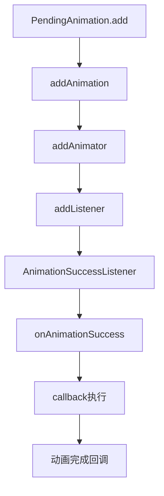
```mermaid
graph TD
    A[PendingAnimation.add] --> B[addAnimation]
    B --> C[addAnimator]
    C --> D[addListener]
    D --> E[AnimationSuccessListener]
    E --> F[onAnimationSuccess]
    F --> G[callback执行]
    G --> H[动画完成回调]
```

### 4.3 动画回调流程

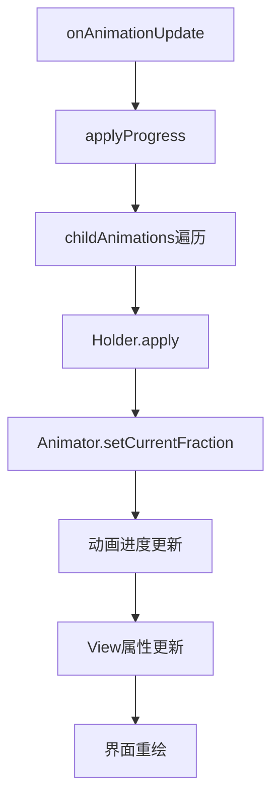
```mermaid
graph TD
    A[onAnimationUpdate] --> B[applyProgress]
    B --> C[childAnimations遍历]
    C --> D[Holder.apply]
    D --> E[Animator.setCurrentFraction]
    E --> F[动画进度更新]
    F --> G[View属性更新]
    G --> H[界面重绘]
```

### 4.4 完整动画控制器结构

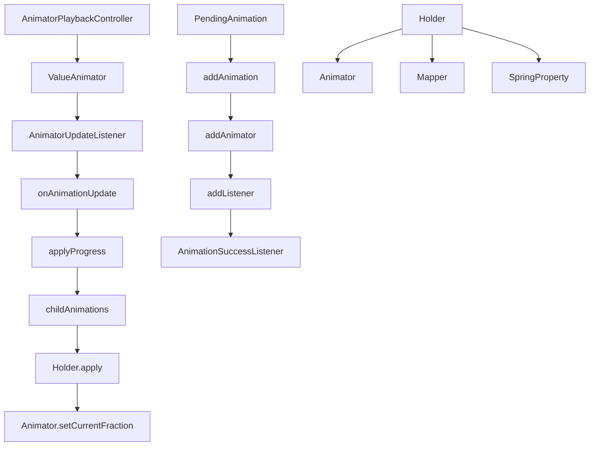
```mermaid
graph TD
    A[AnimatorPlaybackController] --> B[ValueAnimator]
    B --> C[AnimatorUpdateListener]
    C --> D[onAnimationUpdate]
    D --> E[applyProgress]
    E --> F[childAnimations]
    F --> G[Holder.apply]
    G --> H[Animator.setCurrentFraction]
    
    I[PendingAnimation] --> J[addAnimation]
    J --> K[addAnimator]
    K --> L[addListener]
    L --> M[AnimationSuccessListener]
    
    N[Holder] --> O[Animator]
    N --> P[Mapper]
    N --> Q[SpringProperty]
```

### 4.5 手势动画参数

| 参数 | 描述 | 默认值 |
|------|------|--------|
| `MAX_SWIPE_DURATION` | 最大滑动动画持续时间 | 350ms |
| `MIN_PROGRESS_FOR_OVERVIEW` | 进入概览模式的最小进度 | 0.7f |
| `SWIPE_DURATION_MULTIPLIER` | 滑动持续时间乘数 | 1.428f |
| `RECENTS_ATTACH_DURATION` | 最近任务附加动画持续时间 | 300ms |

### 4.6 滑动过程中的动画控制器创建流程

#### 4.6.1 AnimatorPlaybackController创建

1. **触发时机**：在`initCurrentAnimation`方法中
2. **创建流程**：
   - 调用`getShiftRange()`获取滑动范围
   - 创建`PendingAnimation`对象
   - 通过`addAnimationHoldersRecur()`添加动画持有者
   - 调用`AnimatorPlaybackController.wrap()`包装动画
   - 创建`ValueAnimator`并注册`AnimatorUpdateListener`

#### 4.6.2 Holder创建过程

1. **创建时机**：在`addAnimationHoldersRecur`方法中
2. **核心功能**：
   - 持有具体的`Animator`对象
   - 管理动画的进度映射
   - 支持弹簧动画属性
   - 处理动画的应用逻辑

#### 4.6.3 PendingAnimation类继承结构

PendingAnimation的完整继承关系如下：

```
PropertySetter (抽象基类)
    ↓
AnimatedPropertySetter (动画属性设置器)
    ↓
PendingAnimation (待处理动画管理器)
```

#### 4.6.4 add方法注入动画的详细流程

##### 4.6.4.1 核心add方法实现

在`PendingAnimation.java`中，核心的add方法实现：

```java
public void add(Animator a, SpringProperty springProperty) {
    // 1. 将动画添加到AnimatorSet中，并设置统一时长
    mAnim.play(a.setDuration(mDuration));
    
    // 2. 递归处理动画，创建Holder对象
    addAnimationHoldersRecur(a, mDuration, springProperty, mAnimHolders);
}
```

##### 4.6.4.2 addAnimationHoldersRecur递归方法

该方法在`AnimatorPlaybackController.java`中实现：

```java
static void addAnimationHoldersRecur(Animator anim, long globalDuration,
        SpringProperty springProperty, ArrayList<Holder> out) {
    long forceDuration = anim.getDuration();
    TimeInterpolator forceInterpolator = anim.getInterpolator();
    
    if (anim instanceof ValueAnimator) {
        // 创建Holder对象并添加到集合
        out.add(new Holder(anim, globalDuration, springProperty));
    } else if (anim instanceof AnimatorSet) {
        // 递归处理AnimatorSet中的子动画
        for (Animator child : ((AnimatorSet) anim).getChildAnimations()) {
            if (forceDuration > 0) {
                child.setDuration(forceDuration);
            }
            if (forceInterpolator != null) {
                child.setInterpolator(forceInterpolator);
            }
            addAnimationHoldersRecur(child, globalDuration, springProperty, out);
        }
    } else {
        throw new RuntimeException("Unknown animation type " + anim);
    }
}
```

##### 4.6.4.3 Holder类实现

Holder类是动画容器的核心：

```java
static class Holder {
    public final ValueAnimator anim;
    public final SpringProperty springProperty;
    public final TimeInterpolator interpolator;
    public final float globalEndProgress;
    public ProgressMapper mapper;

    Holder(Animator anim, float globalDuration, SpringProperty springProperty) {
        this.anim = (ValueAnimator) anim;
        this.springProperty = springProperty;
        this.interpolator = this.anim.getInterpolator();
        this.globalEndProgress = anim.getDuration() / globalDuration;
        this.mapper = ProgressMapper.DEFAULT;
    }

    public void setProgress(float progress) {
        anim.setCurrentFraction(mapper.getProgress(progress, globalEndProgress));
    }

    public void reset() {
        anim.setInterpolator(interpolator);
        mapper = ProgressMapper.DEFAULT;
    }
}
```

##### 4.6.4.4 动画注入的完整调用链

PendingAnimation提供了多种动画注入方法：

```java
// 基础add方法
public void add(Animator anim) {
    add(anim, SpringProperty.DEFAULT);
}

// 带插值器的add方法
public void add(Animator anim, TimeInterpolator interpolator) {
    add(anim, interpolator, SpringProperty.DEFAULT);
}

// 带插值器和弹簧属性的add方法
public void add(Animator anim, TimeInterpolator interpolator, SpringProperty springProperty) {
    anim.setInterpolator(interpolator);
    add(anim, springProperty);
}
```

##### 4.6.4.5 便捷动画创建方法

```java
// 创建Float属性动画
public <T> void addFloat(T target, FloatProperty<T> property, float from, float to,
        TimeInterpolator interpolator) {
    Animator anim = ObjectAnimator.ofFloat(target, property, from, to);
    anim.setInterpolator(interpolator);
    add(anim);
}

// 创建AnimatedFloat动画（支持取消和重新开始）
public void addAnimatedFloat(AnimatedFloat target, float from, float to,
        TimeInterpolator interpolator) {
    Animator anim = target.animateToValue(from, to);
    anim.setInterpolator(interpolator);
    add(anim);
}
```

#### 4.6.5 动画控制器创建流程

```java
public AnimatorPlaybackController createPlaybackController() {
    return new AnimatorPlaybackController(buildAnim(), mDuration, mAnimHolders);
}
```

其中`buildAnim()`方法确保至少有一个占位动画：

```java
@Override
public AnimatorSet buildAnim() {
    if (mAnimHolders.isEmpty()) {
        // 添加占位动画以确保时长被遵守
        add(ValueAnimator.ofFloat(0, 1).setDuration(mDuration));
    }
    return super.buildAnim();
}
```

#### 4.6.6 回调机制实现

##### 4.6.6.1 AnimationSuccessListener基类

`AnimationSuccessListener`是专门用于监听非取消动画完成的抽象类：

```java
public abstract class AnimationSuccessListener extends AnimatorListenerAdapter {
    protected boolean mCancelled = false;

    @Override
    @CallSuper
    public void onAnimationCancel(Animator animation) {
        mCancelled = true;
    }

    @Override
    public void onAnimationEnd(Animator animation) {
        if (!mCancelled) {
            onAnimationSuccess(animation);
        }
    }

    public abstract void onAnimationSuccess(Animator animator);
}
```

##### 4.6.6.2 AnimatorListeners工具类

提供便捷的回调创建方法：

```java
public class AnimatorListeners {
    // 成功回调
    public static AnimatorListener forSuccessCallback(Runnable callback) {
        return new RunnableSuccessListener(callback);
    }
    
    // 带状态的回调
    public static AnimatorListener forEndCallback(Consumer<Boolean> callback) {
        return new EndStateCallbackWrapper(callback);
    }
    
    // 简单结束回调
    public static AnimatorListener forEndCallback(Runnable callback) {
        return new AnimatorListenerAdapter() {
            @Override
            public void onAnimationEnd(Animator animation) {
                callback.run();
            }
        };
    }
}
```

##### 4.6.6.3 回调类型和使用场景

1. **帧回调 (addOnFrameCallback)**：
   ```java
   public void addOnFrameCallback(Runnable runnable) {
       addOnFrameListener(anim -> runnable.run());
   }
   ```
   **使用场景**：实时更新UI状态，如进度条、实时位置更新等。

2. **结束回调 (addEndListener)**：
   ```java
   @Override
   public void addEndListener(Consumer<Boolean> listener) {
       getProgressAnimator().addListener(AnimatorListeners.forEndCallback(listener));
   }
   ```
   **使用场景**：动画完成后的状态清理、后续操作触发等。

3. **开始回调 (addStartListener)**：
   ```java
   public void addStartListener(Runnable listener) {
       getProgressAnimator().addListener(new AnimatorListenerAdapter() {
           @Override
           public void onAnimationStart(Animator animation) {
               listener.run();
           }
       });
   }
   ```
   **使用场景**：动画开始前的准备工作，如状态重置、资源初始化等。

#### 4.6.7 完整的动画注入流程总结

1. **创建PendingAnimation实例**：指定动画总时长
2. **注入动画**：通过add方法添加各种类型的动画
3. **递归处理**：addAnimationHoldersRecur方法递归处理动画树
4. **创建Holder**：为每个ValueAnimator创建Holder对象
5. **构建控制器**：通过createPlaybackController创建动画控制器
6. **添加回调**：注册各种监听器和回调函数
7. **启动动画**：调用start方法开始动画执行

这个设计模式确保了动画的统一管理和协调控制，支持复杂的动画组合和精确的进度控制。

#### 4.6.8 动画注入调用链图

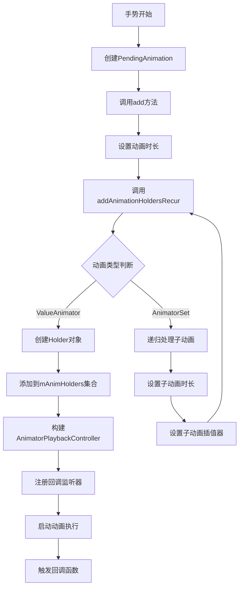
```mermaid
graph TD
    A[手势开始] --> B[创建PendingAnimation]
    B --> C[调用add方法]
    C --> D[设置动画时长]
    D --> E[调用addAnimationHoldersRecur]
    E --> F{动画类型判断}
    F -->|ValueAnimator| G[创建Holder对象]
    F -->|AnimatorSet| H[递归处理子动画]
    H --> I[设置子动画时长]
    I --> J[设置子动画插值器]
    J --> E
    G --> K[添加到mAnimHolders集合]
    K --> L[构建AnimatorPlaybackController]
    L --> M[注册回调监听器]
    M --> N[启动动画执行]
    N --> O[触发回调函数]
```

#### 4.6.9 动画注入时序图

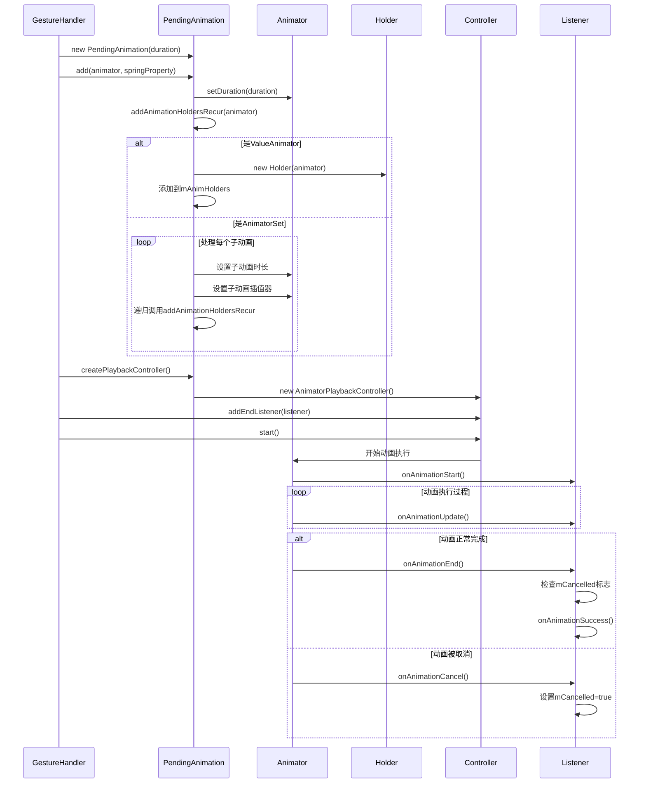
```mermaid
sequenceDiagram
    participant G as GestureHandler
    participant P as PendingAnimation
    participant A as Animator
    participant H as Holder
    participant C as Controller
    participant L as Listener
    
    G->>P: new PendingAnimation(duration)
    G->>P: add(animator, springProperty)
    P->>A: setDuration(duration)
    P->>P: addAnimationHoldersRecur(animator)
    
    alt 是ValueAnimator
        P->>H: new Holder(animator)
        P->>P: 添加到mAnimHolders
    else 是AnimatorSet
        loop 处理每个子动画
            P->>A: 设置子动画时长
            P->>A: 设置子动画插值器
            P->>P: 递归调用addAnimationHoldersRecur
        end
    end
    
    G->>P: createPlaybackController()
    P->>C: new AnimatorPlaybackController()
    G->>C: addEndListener(listener)
    G->>C: start()
    
    C->>A: 开始动画执行
    A->>L: onAnimationStart()
    loop 动画执行过程
        A->>L: onAnimationUpdate()
    end
    
    alt 动画正常完成
        A->>L: onAnimationEnd()
        L->>L: 检查mCancelled标志
        L->>L: onAnimationSuccess()
    else 动画被取消
        A->>L: onAnimationCancel()
        L->>L: 设置mCancelled=true
    end
```

#### 4.6.10 回调机制流程图

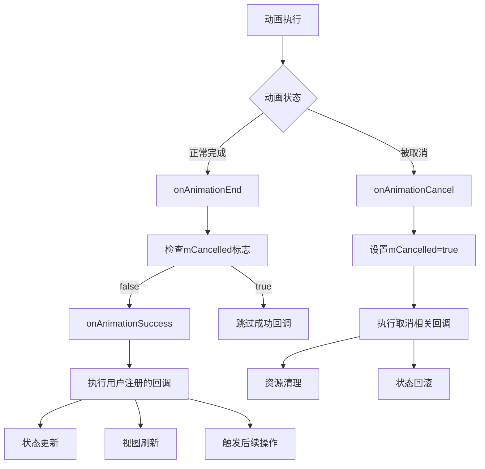
```mermaid
graph TD
    A[动画执行] --> B{动画状态}
    B -->|正常完成| C[onAnimationEnd]
    B -->|被取消| D[onAnimationCancel]
    C --> E[检查mCancelled标志]
    E -->|false| F[onAnimationSuccess]
    E -->|true| G[跳过成功回调]
    F --> H[执行用户注册的回调]
    D --> I[设置mCancelled=true]
    I --> J[执行取消相关回调]
    
    H --> K[状态更新]
    H --> L[视图刷新]
    H --> M[触发后续操作]
    J --> N[资源清理]
    J --> O[状态回滚]
```

#### 4.6.11 实际使用场景示例

在`TaskViewSimulator.java`中的使用：

```java
public void addOverviewToAppAnim(PendingAnimation pa, TimeInterpolator interpolator) {
    pa.addFloat(fullScreenProgress, AnimatedFloat.VALUE, 0, 1, interpolator);
    pa.addFloat(recentsViewScale, AnimatedFloat.VALUE, 1, getFullScreenScale(), interpolator);
}
```

在`SplitInstructionsView.java`中的使用：

```java
public void goBoing() {
    float restingY = getTranslationY();
    float bounceToY = restingY - Utilities.dpToPx(BOUNCE_HEIGHT);
    PendingAnimation anim = new PendingAnimation(BOUNCE_DURATION);
    anim.addFloat(this, TRANSLATE_Y, restingY, bounceToY, Interpolators.STANDARD);
    
    // 添加监听器
    anim.addListener(new AnimatorListenerAdapter() {
        @Override
        public void onAnimationEnd(Animator animation) {
            mIsCurrentlyAnimating = false;
        }
    });
    
    anim.buildAnim().start();
}
```

## 5. 手势类型分析

### 5.1 上滑手势

- **触发条件**：从导航栏向上滑动
- **目标状态**：
  - 快速上滑：进入概览模式
  - 慢速上滑到底：返回主页
  - 上滑后左右滑动：快速切换应用

### 5.2 下滑手势

- **触发条件**：从屏幕顶部向下滑动
- **目标状态**：
  - 概览模式下滑：返回上一个应用
  - 所有应用模式下滑：返回主页

### 5.3 侧滑手势

- **触发条件**：从屏幕左侧或右侧边缘向中间滑动
- **目标状态**：
  - 侧滑返回：执行返回操作
  - 侧滑切换：在应用间切换

## 6. 性能优化

### 6.1 关键优化点

1. **手势识别优化**：使用阈值检测和触摸斜率判断，减少误触发
2. **动画性能**：使用`AnimatorPlaybackController`控制动画播放，支持自定义插值器
3. **状态管理**：使用位标志管理多个状态，减少状态检查开销
4. **触摸事件处理**：使用`SingleAxisSwipeDetector`专注于单轴滑动检测

### 6.2 代码优化建议

1. **减少对象创建**：在触摸事件处理中减少临时对象的创建
2. **优化动画插值**：根据不同手势类型选择合适的插值器
3. **状态预计算**：预先计算可能的目标状态，减少运行时计算
4. **触摸区域优化**：精确计算触摸区域，减少不必要的事件处理

## 7. 设计思想和理念

### 7.1 统一性与一致性设计理念

#### 7.1.1 统一的动画管理架构
```java
// 统一的继承结构
PropertySetter → AnimatedPropertySetter → PendingAnimation
```

**设计思想**：通过统一的基类和接口，确保所有动画遵循相同的设计模式，提供一致的API和行为。

#### 7.1.2 一致的时长管理
```java
public void add(Animator a, SpringProperty springProperty) {
    mAnim.play(a.setDuration(mDuration));  // 统一时长设置
}
```

**设计理念**：所有动画使用统一的时长设置，确保动画同步和协调，避免不同动画之间的时间不一致问题。

### 7.2 递归与组合设计模式

#### 7.2.1 递归处理机制
```java
static void addAnimationHoldersRecur(Animator anim, long globalDuration,
        SpringProperty springProperty, ArrayList<Holder> out) {
    // 递归处理动画树
}
```

**设计思想**：采用递归算法处理复杂的动画组合，支持任意深度的动画嵌套，体现了"分而治之"的设计原则。

#### 7.2.2 组合模式应用
```java
if (anim instanceof AnimatorSet) {
    for (Animator child : ((AnimatorSet) anim).getChildAnimations()) {
        addAnimationHoldersRecur(child, globalDuration, springProperty, out);
    }
}
```

**设计理念**：将复杂动画分解为简单动画的组合，通过组合模式实现动画的灵活构建和复用。

### 7.3 容器化与生命周期管理

#### 7.3.1 Holder容器设计
```java
static class Holder {
    public final ValueAnimator anim;
    public final SpringProperty springProperty;
    // 统一管理动画属性和状态
}
```

**设计思想**：通过容器模式统一管理动画实例，实现动画资源的集中管理和生命周期控制。

#### 7.3.2 精确的状态管理
```java
public void setProgress(float progress) {
    anim.setCurrentFraction(mapper.getProgress(progress, globalEndProgress));
}
```

**设计理念**：提供精确的进度控制机制，确保动画状态的可预测性和可控性。

### 7.4 回调与事件驱动架构

#### 7.4.1 分层回调机制
```java
public abstract class AnimationSuccessListener extends AnimatorListenerAdapter {
    protected boolean mCancelled = false;  // 状态标志管理
}
```

**设计思想**：采用分层的事件驱动架构，支持不同粒度的回调处理，从帧级更新到动画完成事件。

#### 7.4.2 状态安全保证
```java
@Override
public void onAnimationEnd(Animator animation) {
    if (!mCancelled) {
        onAnimationSuccess(animation);  // 状态安全检查
    }
}
```

**设计理念**：通过状态标志确保回调的安全性，防止因动画取消导致的意外行为。

### 7.5 性能与效率优化理念

#### 7.5.1 对象复用机制
```java
private final ArrayList<Holder> mAnimHolders = new ArrayList<>();  // 复用容器
```

**设计思想**：通过对象池和复用机制减少内存分配，提高动画执行的效率。

#### 7.5.2 延迟计算策略
```java
private ValueAnimator getProgressAnimator() {
    if (mProgressAnimator == null) {
        mProgressAnimator = ValueAnimator.ofFloat(0, 1);  // 延迟创建
    }
    return mProgressAnimator;
}
```

**设计理念**：采用延迟计算策略，只在需要时创建资源，优化内存使用和启动性能。

### 7.6 可扩展性与灵活性设计

#### 7.6.1 插件化架构
```java
public <T> void addFloat(T target, FloatProperty<T> property, float from, float to,
        TimeInterpolator interpolator) {
    // 支持任意类型的属性动画
}
```

**设计思想**：通过泛型和接口设计，支持任意类型的动画属性，实现高度的可扩展性。

#### 7.6.2 弹簧动画支持
```java
public void add(Animator a, SpringProperty springProperty) {
    // 支持弹簧动画属性
}
```

**设计理念**：内置对物理动画（弹簧效果）的支持，提供更自然的交互体验。

### 7.7 错误处理与健壮性设计

#### 7.7.1 异常处理机制
```java
} else {
    throw new RuntimeException("Unknown animation type " + anim);
}
```

**设计思想**：明确的异常处理机制，确保在遇到未知动画类型时能够及时发现问题。

#### 7.7.2 空动画保护
```java
if (mAnimHolders.isEmpty()) {
    add(ValueAnimator.ofFloat(0, 1).setDuration(mDuration));  // 占位动画
}
```

**设计理念**：通过占位动画机制确保即使没有实际动画也能保持正确的时长和行为。

### 7.8 用户体验导向的设计哲学

#### 7.8.1 流畅性优先
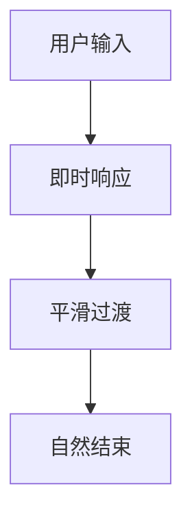
```mermaid
graph TD
    A[用户输入] --> B[即时响应]
    B --> C[平滑过渡]
    C --> D[自然结束]
```

**设计思想**：所有动画设计都以用户体验为中心，确保操作的即时响应和视觉的流畅过渡。

#### 7.8.2 物理真实性
```java
public SpringProperty setDampingRatio(float dampingRatio) {
    mDampingRatio = dampingRatio;  // 物理阻尼系数
    return this;
}
```

**设计理念**：模拟真实物理效果，通过弹簧动画提供符合用户心理预期的交互反馈。

### 7.9 系统集成与协同设计

#### 7.9.1 线程安全设计
```java
Utilities.postAsyncCallback(MAIN_EXECUTOR.getHandler(), () -> {
    // 切换到主线程执行回调
});
```

**设计思想**：充分考虑多线程环境下的安全性，确保动画回调在主线程执行。

#### 7.9.2 系统资源协调
```java
public void logAnimationProgressToTrace(String counterName) {
    if (Trace.isEnabled()) {
        // 与系统追踪工具集成
    }
}
```

**设计理念**：与系统工具深度集成，支持性能监控和调试分析。

### 7.10 总结：核心设计哲学

#### 7.10.1 统一管理原则
通过统一的架构和接口，确保所有动画遵循相同的设计模式和行为规范。

#### 7.10.2 递归组合思想
采用递归算法和组合模式处理复杂动画，实现动画的灵活构建和复用。

#### 7.10.3 生命周期控制
通过容器化设计和精确的状态管理，实现动画资源的有效管理和控制。

#### 7.10.4 事件驱动架构
基于回调机制的事件驱动设计，支持灵活的动画生命周期管理。

#### 7.10.5 性能优化导向
从对象复用、延迟计算到线程安全，全面考虑性能优化。

#### 7.10.6 用户体验中心
所有设计决策都以提供流畅、自然的用户体验为最终目标。

这种设计思想和理念不仅体现在代码实现层面，更反映了Android系统对高质量动画交互的深刻理解和持续追求。

## 8. 动画分类和标签系统设计方案

### 8.1 设计目标

- **分类管理**：支持按功能、类型、优先级等维度对动画进行分类
- **唯一标识**：为每个动画提供唯一的标签，便于调试和追踪
- **调用链追踪**：记录动画的创建位置和方法调用栈
- **性能监控**：支持按分类进行性能统计和分析

### 8.2 核心设计思路

#### 8.2.1 扩展Holder类

```java
static class Holder {
    public final ValueAnimator anim;
    public final SpringProperty springProperty;
    public final TimeInterpolator interpolator;
    public final float globalEndProgress;
    public ProgressMapper mapper;
    
    // 新增字段：分类和标签系统
    public final String category;        // 动画分类
    public final String tag;             // 唯一标签
    public final String creatorMethod;   // 创建方法名
    public final StackTraceElement[] creationStack; // 创建调用栈
    
    Holder(Animator anim, float globalDuration, SpringProperty springProperty, 
           String category, String tag, String creatorMethod) {
        this.anim = (ValueAnimator) anim;
        this.springProperty = springProperty;
        this.interpolator = this.anim.getInterpolator();
        this.globalEndProgress = anim.getDuration() / globalDuration;
        this.mapper = ProgressMapper.DEFAULT;
        
        // 初始化分类和标签
        this.category = category != null ? category : "default";
        this.tag = tag != null ? tag : generateUniqueTag();
        this.creatorMethod = creatorMethod != null ? creatorMethod : getCallerMethodName();
        this.creationStack = Thread.currentThread().getStackTrace();
    }
    
    private String generateUniqueTag() {
        return "anim_" + System.currentTimeMillis() + "_" + System.identityHashCode(this);
    }
    
    private String getCallerMethodName() {
        StackTraceElement[] stack = Thread.currentThread().getStackTrace();
        // 跳过Holder构造函数和addAnimationHoldersRecur方法
        for (int i = 3; i < stack.length; i++) {
            String className = stack[i].getClassName();
            if (!className.contains("AnimatorPlaybackController") && 
                !className.contains("PendingAnimation")) {
                return stack[i].getMethodName();
            }
        }
        return "unknown";
    }
}
```

#### 8.2.2 扩展PendingAnimation类

```java
public class PendingAnimation extends AnimatedPropertySetter {
    private final ArrayList<Holder> mAnimHolders = new ArrayList<>();
    private final long mDuration;
    
    // 新增：分类管理器
    private final Map<String, List<Holder>> mCategoryMap = new HashMap<>();
    private final Map<String, Holder> mTagMap = new HashMap<>();
    
    public PendingAnimation(long duration) {
        mDuration = duration;
    }
    
    // 扩展的add方法，支持分类和标签
    public void add(Animator a, SpringProperty springProperty, String category, String tag) {
        mAnim.play(a.setDuration(mDuration));
        addAnimationHoldersRecur(a, mDuration, springProperty, mAnimHolders, category, tag);
    }
    
    // 重载方法，保持向后兼容
    public void add(Animator a, SpringProperty springProperty) {
        add(a, springProperty, "default", null);
    }
    
    // 便捷方法：带分类的add
    public void addWithCategory(Animator a, String category) {
        add(a, SpringProperty.DEFAULT, category, null);
    }
    
    // 便捷方法：带标签的add
    public void addWithTag(Animator a, String tag) {
        add(a, SpringProperty.DEFAULT, "default", tag);
    }
    
    // 扩展的addFloat方法
    public <T> void addFloat(T target, FloatProperty<T> property, float from, float to,
            TimeInterpolator interpolator, String category, String tag) {
        Animator anim = ObjectAnimator.ofFloat(target, property, from, to);
        anim.setInterpolator(interpolator);
        add(anim, SpringProperty.DEFAULT, category, tag);
    }
}
```

#### 8.2.3 扩展addAnimationHoldersRecur方法

```java
static void addAnimationHoldersRecur(Animator anim, long globalDuration,
        SpringProperty springProperty, ArrayList<Holder> out, 
        String category, String tag) {
    long forceDuration = anim.getDuration();
    TimeInterpolator forceInterpolator = anim.getInterpolator();
    
    if (anim instanceof ValueAnimator) {
        Holder holder = new Holder(anim, globalDuration, springProperty, category, tag, null);
        out.add(holder);
        
        // 更新分类映射
        updateCategoryMapping(holder);
        
    } else if (anim instanceof AnimatorSet) {
        for (Animator child : ((AnimatorSet) anim).getChildAnimations()) {
            if (forceDuration > 0) {
                child.setDuration(forceDuration);
            }
            if (forceInterpolator != null) {
                child.setInterpolator(forceInterpolator);
            }
            // 为子动画生成子标签
            String childTag = tag != null ? tag + "_child" : null;
            addAnimationHoldersRecur(child, globalDuration, springProperty, out, category, childTag);
        }
    } else {
        throw new RuntimeException("Unknown animation type " + anim);
    }
}
```

### 8.3 分类系统设计

#### 8.3.1 预定义动画分类

```java
public class AnimationCategories {
    // 按功能分类
    public static final String CATEGORY_GESTURE = "gesture";
    public static final String CATEGORY_TRANSITION = "transition";
    public static final String CATEGORY_ICON = "icon";
    public static final String CATEGORY_TASKBAR = "taskbar";
    public static final String CATEGORY_RECENTS = "recents";
    
    // 按类型分类
    public static final String CATEGORY_ALPHA = "alpha";
    public static final String CATEGORY_TRANSLATION = "translation";
    public static final String CATEGORY_SCALE = "scale";
    public static final String CATEGORY_ROTATION = "rotation";
    
    // 按优先级分类
    public static final String CATEGORY_HIGH_PRIORITY = "high_priority";
    public static final String CATEGORY_NORMAL_PRIORITY = "normal_priority";
    public static final String CATEGORY_LOW_PRIORITY = "low_priority";
    
    // 按状态分类
    public static final String CATEGORY_ENTER = "enter";
    public static final String CATEGORY_EXIT = "exit";
    public static final String CATEGORY_UPDATE = "update";
}
```

#### 8.3.2 标签命名规范

```java
public class AnimationTags {
    // 格式：{组件}_{动作}_{目标}_{序号}
    // 示例：
    public static final String TAG_TASKBAR_SHOW = "taskbar_show_main";
    public static final String TAG_ICON_SCALE_UP = "icon_scale_up_app_icon_1";
    public static final String TAG_RECENTS_SWIPE = "recents_swipe_task_view_2";
    
    // 动态标签生成器
    public static String generateTag(String component, String action, String target) {
        return String.format("%s_%s_%s_%d", component, action, target, System.currentTimeMillis() % 1000);
    }
}
```

### 8.4 查询和调试接口

#### 8.4.1 查询方法

```java
public class PendingAnimation extends AnimatedPropertySetter {
    // 按分类查询动画
    public List<Holder> getAnimationsByCategory(String category) {
        return mCategoryMap.getOrDefault(category, Collections.emptyList());
    }
    
    // 按标签查询动画
    public Holder getAnimationByTag(String tag) {
        return mTagMap.get(tag);
    }
    
    // 获取所有分类
    public Set<String> getCategories() {
        return mCategoryMap.keySet();
    }
    
    // 获取分类统计
    public Map<String, Integer> getCategoryStatistics() {
        Map<String, Integer> stats = new HashMap<>();
        for (Map.Entry<String, List<Holder>> entry : mCategoryMap.entrySet()) {
            stats.put(entry.getKey(), entry.getValue().size());
        }
        return stats;
    }
    
    // 调试信息输出
    public void dumpAnimationInfo() {
        Log.d("PendingAnimation", "=== Animation Dump ===");
        Log.d("PendingAnimation", "Total animations: " + mAnimHolders.size());
        
        for (Map.Entry<String, List<Holder>> entry : mCategoryMap.entrySet()) {
            Log.d("PendingAnimation", "Category: " + entry.getKey() + 
                  ", Count: " + entry.getValue().size());
            
            for (Holder holder : entry.getValue()) {
                Log.d("PendingAnimation", "  Tag: " + holder.tag + 
                      ", Method: " + holder.creatorMethod);
            }
        }
    }
}
```

#### 8.4.2 性能监控接口

```java
public class AnimationPerformanceMonitor {
    private final Map<String, PerformanceStats> mCategoryStats = new HashMap<>();
    
    public void onAnimationStart(Holder holder) {
        PerformanceStats stats = mCategoryStats.computeIfAbsent(
            holder.category, k -> new PerformanceStats());
        stats.startTime = System.currentTimeMillis();
    }
    
    public void onAnimationEnd(Holder holder) {
        PerformanceStats stats = mCategoryStats.get(holder.category);
        if (stats != null) {
            long duration = System.currentTimeMillis() - stats.startTime;
            stats.totalDuration += duration;
            stats.executionCount++;
        }
    }
    
    public void logPerformanceReport() {
        for (Map.Entry<String, PerformanceStats> entry : mCategoryStats.entrySet()) {
            PerformanceStats stats = entry.getValue();
            double avgDuration = stats.executionCount > 0 ? 
                (double) stats.totalDuration / stats.executionCount : 0;
            
            Log.d("AnimationPerformance", 
                String.format("Category: %s, Count: %d, Avg Duration: %.2fms", 
                    entry.getKey(), stats.executionCount, avgDuration));
        }
    }
    
    private static class PerformanceStats {
        long startTime;
        long totalDuration;
        int executionCount;
    }
}
```

### 8.5 实际使用示例

#### 8.5.1 在TaskViewSimulator中的使用

```java
public void addOverviewToAppAnim(PendingAnimation pa, TimeInterpolator interpolator) {
    pa.addFloat(fullScreenProgress, AnimatedFloat.VALUE, 0, 1, interpolator,
        AnimationCategories.CATEGORY_TRANSITION, 
        AnimationTags.generateTag("taskview", "overview_to_app", "fullscreen"));
        
    pa.addFloat(recentsViewScale, AnimatedFloat.VALUE, 1, getFullScreenScale(), interpolator,
        AnimationCategories.CATEGORY_SCALE,
        AnimationTags.generateTag("taskview", "scale", "recents_view"));
}
```

#### 8.5.2 在SplitInstructionsView中的使用

```java
public void goBoing() {
    float restingY = getTranslationY();
    float bounceToY = restingY - Utilities.dpToPx(BOUNCE_HEIGHT);
    PendingAnimation anim = new PendingAnimation(BOUNCE_DURATION);
    
    anim.addFloat(this, TRANSLATE_Y, restingY, bounceToY, Interpolators.STANDARD,
        AnimationCategories.CATEGORY_GESTURE,
        AnimationTags.generateTag("instructions", "bounce", "translation"));
    
    // 添加监听器时可以使用标签进行精确控制
    anim.addListener(new AnimatorListenerAdapter() {
        @Override
        public void onAnimationEnd(Animator animation) {
            // 通过标签找到特定动画进行处理
            Holder holder = anim.getAnimationByTag("instructions_bounce_translation");
            if (holder != null) {
                Log.d("AnimationDebug", "Bounce animation completed: " + holder.creatorMethod);
            }
            mIsCurrentlyAnimating = false;
        }
    });
    
    anim.buildAnim().start();
}
```

### 8.6 设计优势

1. **调试友好**：通过分类和标签快速定位特定动画
2. **性能监控**：按分类统计动画性能，便于优化
3. **向后兼容**：保持原有API不变，新增功能可选
4. **扩展性强**：支持自定义分类体系和标签规则
5. **调用链追踪**：记录动画创建位置，便于问题排查

这个设计方案既保持了原有系统的简洁性，又提供了强大的调试和监控能力，非常适合Launcher这种复杂的动画系统。

## 9. 总结

Launcher手势动画系统是一个复杂而精巧的设计，通过多层次的控制器和动画系统，实现了流畅的手势交互体验。核心组件包括：

1. **触摸事件分发**：从`MotionEvent`到具体控制器的分发流程
2. **手势识别**：通过`SingleAxisSwipeDetector`识别不同类型的手势
3. **状态管理**：通过`LauncherState`和状态标志管理不同的界面状态
4. **动画控制**：通过`AnimatorPlaybackController`控制动画的播放和进度
5. **系统交互**：与SystemUI和WindowManager的交互，实现窗口变换和状态切换

这种设计不仅提供了流畅的用户体验，也为不同设备和导航模式提供了灵活的适配能力。

## 10. 参考资料

- [Android Developer Documentation](https://developer.android.com/)
- [Launcher3 Source Code](https://android.googlesource.com/platform/packages/apps/Launcher3/)
- [SystemUI Gesture Handling](https://android.googlesource.com/platform/frameworks/base/packages/SystemUI/)
