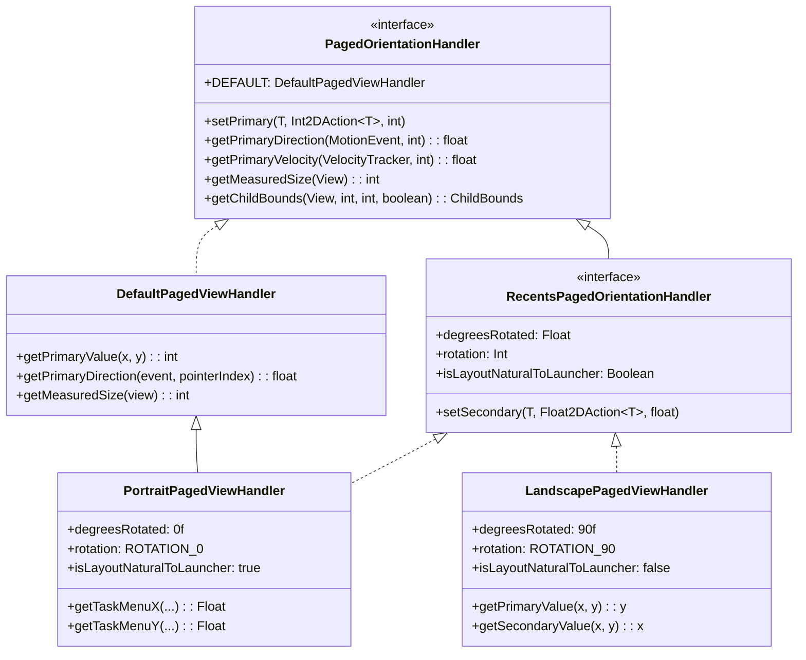
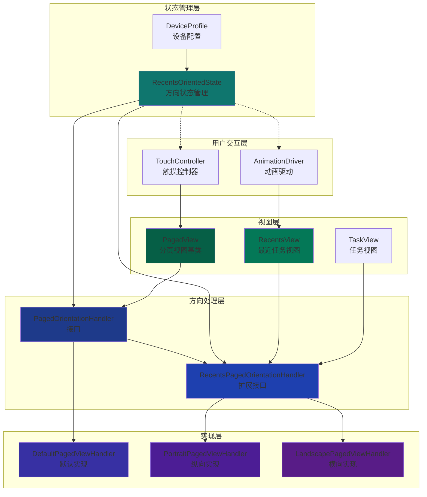
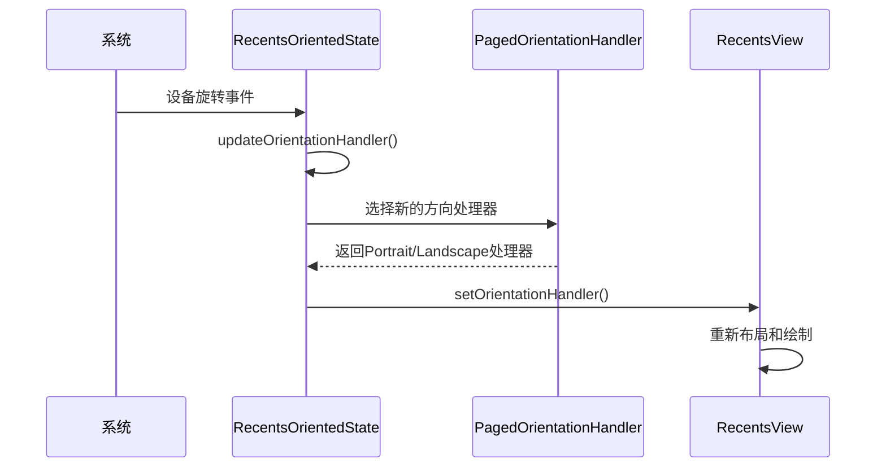
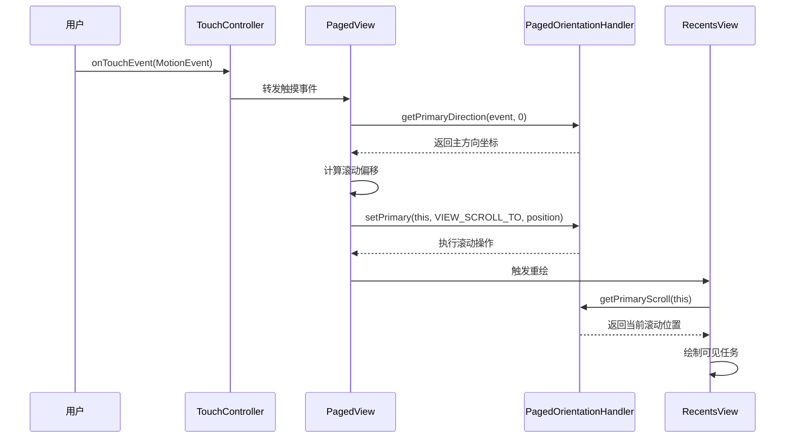

# PagedOrientationHandler接口分析报告

## 概述

PagedOrientationHandler是Android Launcher3中一个高度抽象的方向处理接口，主要用于分离横向和纵向布局的具体实现，为分页视图（PagedView）和最近任务视图（RecentsView）提供统一的方向处理逻辑。

**源码位置**: 
- 接口定义: `src/com/android/launcher3/touch/PagedOrientationHandler.java`
- 默认实现: `src/com/android/launcher3/touch/DefaultPagedViewHandler.java`
- 纵向实现: `quickstep/src/com/android/quickstep/orientation/PortraitPagedViewHandler.kt`
- 横向实现: `quickstep/src/com/android/quickstep/orientation/LandscapePagedViewHandler.kt`
- 扩展接口: `quickstep/src/com/android/quickstep/orientation/RecentsPagedOrientationHandler.kt`

## 接口设计理念

### 核心目标
1. **统一处理方向逻辑**：将X/Y轴操作抽象为"主方向"和"次方向"
2. **简化方向切换**：通过接口实现轻松切换横向/纵向布局
3. **减少代码重复**：避免在多个地方重复编写方向判断逻辑

### 设计优势
- **解耦设计**：方向逻辑与视图逻辑分离
- **扩展性强**：新增方向模式只需实现接口
- **性能优化**：避免运行时频繁方向判断
- **一致性保证**：统一接口确保行为一致性

## 接口层次结构

### 基础接口：PagedOrientationHandler

```java
public interface PagedOrientationHandler {
    PagedOrientationHandler DEFAULT = new DefaultPagedViewHandler();
    
    // 功能型接口
    interface Int2DAction<T> { void call(T target, int x, int y); }
    interface Float2DAction<T> { void call(T target, float x, float y); }
    
    // 核心方法
    <T> void setPrimary(T target, Int2DAction<T> action, int param);
    float getPrimaryDirection(MotionEvent event, int pointerIndex);
    float getPrimaryVelocity(VelocityTracker velocityTracker, int pointerId);
    int getMeasuredSize(View view);
    ChildBounds getChildBounds(View child, int childStart, int pageCenter, boolean layoutChild);
}
```

### 扩展接口：RecentsPagedOrientationHandler

```kotlin
interface RecentsPagedOrientationHandler : PagedOrientationHandler {
    // 扩展方法
    fun <T> setSecondary(target: T, action: Float2DAction<T>, param: Float)
    operator fun <T> set(target: T, action: Int2DAction<T>, primaryParam: Int, secondaryParam: Int)
    
    // 旋转相关属性
    val degreesRotated: Float
    val rotation: Int
    val isLayoutNaturalToLauncher: Boolean
}
```

## 实现类分析

### 1. DefaultPagedViewHandler（默认实现）

**特点**：
- 提供基础的横向布局实现
- 将X轴作为主方向
- 作为其他实现的基类

**关键方法实现**：
```java
@Override
public int getPrimaryValue(int x, int y) {
    return x;  // 横向为主方向
}

@Override
public float getPrimaryDirection(MotionEvent event, int pointerIndex) {
    return event.getX(pointerIndex);
}
```

### 2. PortraitPagedViewHandler（纵向布局）

**特点**：
- 继承DefaultPagedViewHandler
- 实现RecentsPagedOrientationHandler
- `degreesRotated = 0f`（无旋转）
- `rotation = Surface.ROTATION_0`
- `isLayoutNaturalToLauncher = true`

**适用场景**：纵向设备、自然布局

### 3. LandscapePagedViewHandler（横向布局）

**特点**：
- 直接实现RecentsPagedOrientationHandler
- 将Y轴作为主方向，X轴作为次方向
- `degreesRotated = 90f`（旋转90度）
- `rotation = Surface.ROTATION_90`
- `isLayoutNaturalToLauncher = false`

**关键方法实现**：
```kotlin
override fun <T> getPrimaryValue(x: T, y: T): T = y  // 纵向为主方向
override fun <T> getSecondaryValue(x: T, y: T): T = x
```

## 实现类对比表

| 实现类 | 主方向 | 旋转角度 | 布局自然性 | 适用场景 |
|--------|--------|----------|------------|----------|
| **DefaultPagedViewHandler** | X轴 | 0° | 自然 | 基础横向布局 |
| **PortraitPagedViewHandler** | X轴 | 0° | 自然 | 纵向设备 |
| **LandscapePagedViewHandler** | Y轴 | 90° | 非自然 | 横向设备 |

## 架构设计

### 类图



### 系统架构图



## 使用方法与调用关系

### 1. 初始化与配置

在`RecentsOrientedState.java`中动态选择实现：

```java
private RecentsPagedOrientationHandler mOrientationHandler = 
    RecentsPagedOrientationHandler.PORTRAIT; // 默认纵向

public void updateOrientationHandler() {
    if (isPortraitMode()) {
        mOrientationHandler = RecentsPagedOrientationHandler.PORTRAIT;
    } else {
        mOrientationHandler = RecentsPagedOrientationHandler.LANDSCAPE;
    }
    
    // 通知相关视图更新
    mContainerInterface.setOrientationHandler(mOrientationHandler);
}
```

### 2. 在PagedView中的使用

**关键调用示例**：

```java
// 滚动操作
mOrientationHandler.setPrimary(this, VIEW_SCROLL_TO, newPosition);

// 获取滚动位置
int oldPos = mOrientationHandler.getPrimaryScroll(this);

// 子视图布局
ChildBounds bounds = mOrientationHandler.getChildBounds(child, childStart, pageCenter, layoutChildren);

// 触摸事件处理
mDownMotionPrimary = mOrientationHandler.getPrimaryDirection(ev, 0);
```

### 3. 在RecentsView中的使用

**扩展使用场景**：

```java
// 画布变换
getPagedOrientationHandler().setPrimary(canvas, CANVAS_TRANSLATE, scroll);

// 任务视图可见性判断
int screenStart = getPagedOrientationHandler().getPrimaryScroll(this);
int screenEnd = screenStart + getPagedOrientationHandler().getMeasuredSize(this);

// 任务菜单位置计算
getPagedOrientationHandler().getTaskMenuX(x, thumbnailView, deviceProfile, taskInsetMargin, taskViewIcon);
```

## 时序图分析

### 方向变化处理流程



### 用户滑动操作流程



## 关键技术特性

### 1. 方向抽象机制

```java
// 将X/Y坐标抽象为主/次方向
int primary = handler.getPrimaryValue(x, y);
int secondary = handler.getSecondaryValue(x, y);

// 纵向：primary=x, secondary=y  
// 横向：primary=y, secondary=x
```

### 2. 统一操作接口

```java
// 滚动操作统一处理
handler.setPrimary(view, VIEW_SCROLL_TO, position);

// 尺寸获取统一处理  
int size = handler.getMeasuredSize(view);

// 边界计算统一处理
ChildBounds bounds = handler.getChildBounds(child, start, center, layout);
```

### 3. 动态适配机制

通过`RecentsOrientedState`实现：
- 实时监测设备方向变化
- 动态切换方向处理器
- 保持UI状态一致性

## 实际应用场景

### 1. 分页滚动
在`PagedView.java`中：
- 触摸事件的方向处理
- 滚动位置的计算和设置
- 子视图的布局计算

### 2. 最近任务管理
在`RecentsView.java`中：
- 任务视图的可见性判断
- 任务菜单的位置计算
- 动画变换的方向处理

### 3. 多任务分屏
在分屏场景中：
- 不同方向的分屏布局计算
- 任务边界的位置调整
- 动画效果的统一处理

## 核心方法详解

### 方向抽象方法

| 方法名 | 参数 | 返回值 | 说明 |
|--------|------|--------|------|
| `getPrimaryValue(x, y)` | int/int 或 float/float | 主方向值 | 获取主方向坐标值 |
| `getSecondaryValue(x, y)` | int/int 或 float/float | 次方向值 | 获取次方向坐标值 |
| `setPrimary(target, action, param)` | 目标对象, 动作接口, 参数 | void | 设置主方向参数 |

### 滚动相关方法

| 方法名 | 参数 | 返回值 | 说明 |
|--------|------|--------|------|
| `getPrimaryScroll(view)` | View | int | 获取主方向滚动位置 |
| `getMeasuredSize(view)` | View | int | 获取主方向尺寸 |
| `setMaxScroll(event, maxScroll)` | AccessibilityEvent, int | void | 设置最大滚动范围 |

### 布局相关方法

| 方法名 | 参数 | 返回值 | 说明 |
|--------|------|--------|------|
| `getChildBounds(child, start, center, layout)` | View, int, int, boolean | ChildBounds | 计算子视图边界 |
| `getCenterForPage(view, insets)` | View, Rect | int | 获取页面中心位置 |
| `getScrollOffsetStart/End(view, insets)` | View, Rect | int | 获取滚动偏移 |

## 总结

PagedOrientationHandler是Android Launcher中一个**高度抽象且设计精良的方向处理框架**。通过将方向逻辑抽象为统一的接口，它成功解决了多方向适配的复杂性，为Launcher的流畅用户体验提供了坚实的技术基础。

### 主要贡献
1. **架构清晰**：明确的层次结构和职责分离
2. **扩展性强**：易于添加新的方向模式
3. **性能优秀**：避免了重复的方向判断逻辑
4. **维护性好**：统一的接口降低了代码复杂度

### 适用场景
这种设计模式在需要处理多种方向场景的UI框架中具有很高的参考价值，特别是：
- 多方向适配的应用程序
- 复杂的布局管理系统
- 需要动态切换UI方向的场景

---

**文档版本**: 1.0  
**分析时间**: 2026-01-29  
**源码版本**: Android16 QPR2 Release