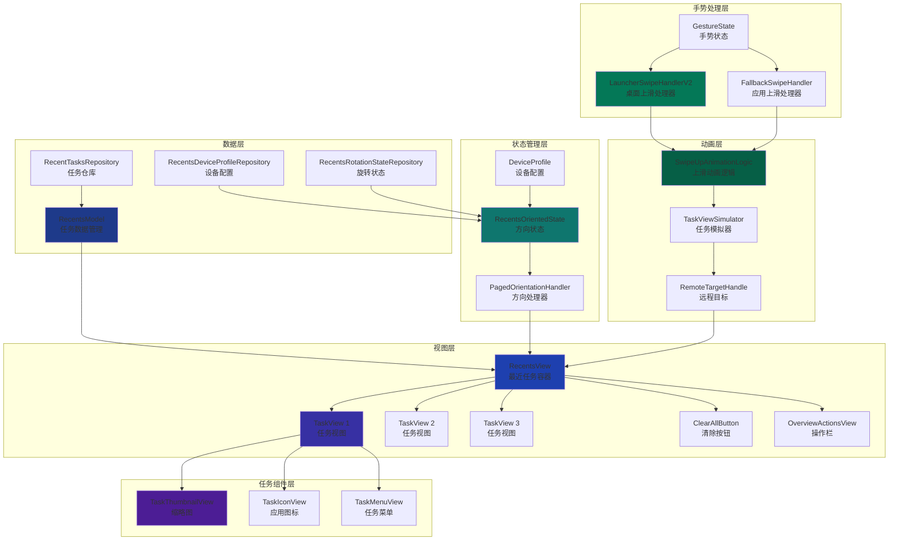
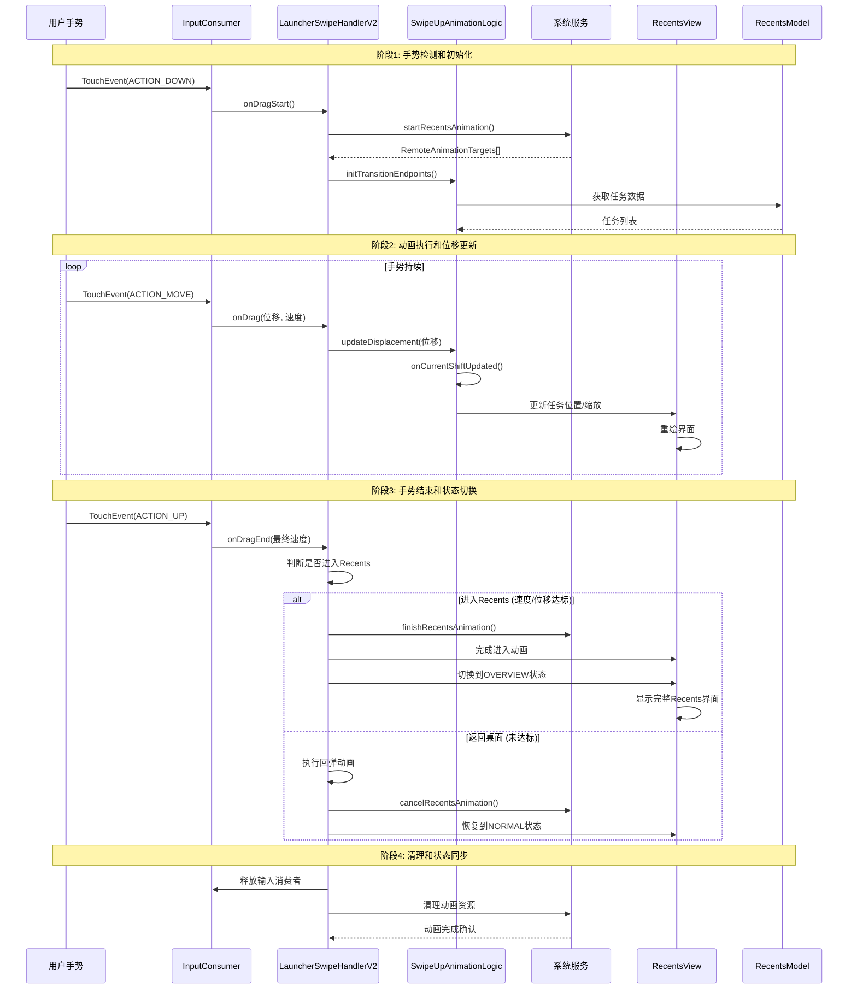
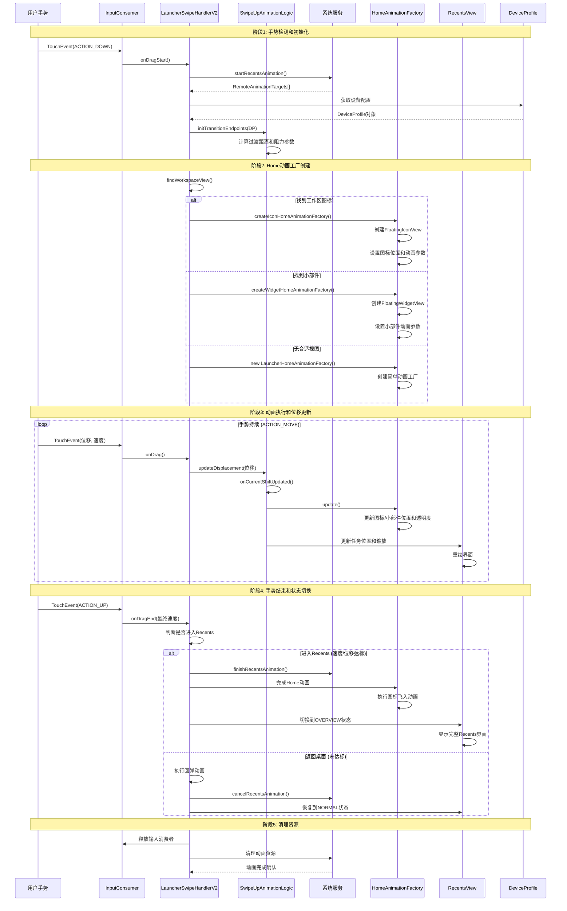
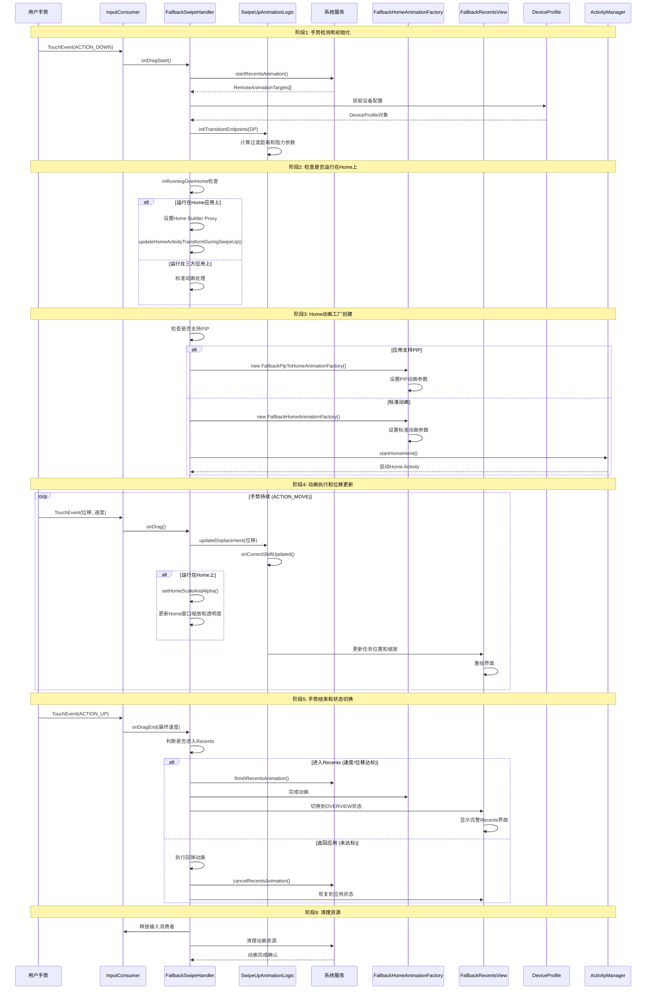

# Recents布局及上滑流程分析报告

## 概述

本报告基于对AOSP Launcher3源码的深入分析，全面解析了Recents（最近任务）界面的布局架构以及从桌面和三方应用上滑进入Recents的完整流程。

**源码位置**: 
- RecentsView: `quickstep/src/com/android/quickstep/views/RecentsView.java`
- TaskView: `quickstep/src/com/android/quickstep/views/TaskView.java`
- LauncherSwipeHandlerV2: `quickstep/src/com/android/quickstep/LauncherSwipeHandlerV2.java`
- FallbackSwipeHandler: `quickstep/src/com/android/quickstep/FallbackSwipeHandler.java`
- SwipeUpAnimationLogic: `quickstep/src/com/android/quickstep/SwipeUpAnimationLogic.java`

## Recents布局架构分析

### 核心组件架构

Recents（最近任务）界面是Android多任务系统的核心，其架构设计高度模块化，主要包含以下核心组件：

#### 1. RecentsView - 最近任务视图容器

RecentsView是继承自PagedView的抽象类，负责：
- 管理所有TaskView的布局和显示
- 处理分页滚动逻辑
- 实现任务切换动画
- 支持横向/纵向布局适配

```java
public abstract class RecentsView<
        CONTAINER_TYPE extends Context & RecentsViewContainer & StatefulContainer<STATE_TYPE>,
        STATE_TYPE extends BaseState<STATE_TYPE>> extends PagedView implements Insettable,
        HighResLoadingState.HighResLoadingStateChangedCallback,
        TaskVisualsChangeListener {
```

#### 2. TaskView - 单个任务视图

每个TaskView代表一个运行中的应用程序任务，负责：
- 显示任务缩略图
- 处理任务操作（启动、关闭、分屏等）
- 实现任务动画效果
- 管理任务菜单

#### 3. RecentsModel - 数据模型层

负责与系统服务交互，管理任务数据：
- 从ActivityManager获取运行中的任务列表
- 缓存任务缩略图数据
- 处理任务状态变化通知

#### 4. RecentsOrientedState - 方向状态管理

管理Recents界面的方向状态：
- 动态选择Portrait/Landscape方向处理器
- 处理设备旋转事件
- 维护方向相关的配置信息

### 布局层次结构

```
RecentsView (PagedView)
├── TaskView 1
│   ├── TaskThumbnailView (缩略图)
│   ├── IconView (应用图标)
│   └── TaskMenuView (任务菜单)
├── TaskView 2
├── ClearAllButton (清除所有按钮)
└── OverviewActionsView (概览操作栏)
```

### 关键布局特性

#### 1. 分页布局机制
RecentsView继承自PagedView，支持：
- 水平/垂直分页滚动
- 惯性滚动效果
- 边缘回弹效果
- 无障碍访问支持

#### 2. 方向自适应
通过PagedOrientationHandler实现：
- 纵向模式：水平分页，X轴为主方向
- 横向模式：垂直分页，Y轴为主方向
- 动态方向切换支持

#### 3. 任务布局策略
- **网格布局**：多任务并排显示
- **全屏布局**：单个任务占据全屏
- **分屏布局**：支持Split Screen模式

## 桌面上滑流程分析

桌面上滑流程涉及从Launcher界面切换到Recents界面的完整动画过程。

### 核心处理类

#### 1. LauncherSwipeHandlerV2
桌面上滑的主要处理类，继承自AbsSwipeUpHandler：

```java
public class LauncherSwipeHandlerV2 extends AbsSwipeUpHandler<
        QuickstepLauncher, RecentsView<QuickstepLauncher, LauncherState>, LauncherState> {
```

#### 2. SwipeUpAnimationLogic
上滑动画逻辑的抽象基类，处理：
- 位移计算和动画进度管理
- 远程动画目标处理
- 阻力效果实现

### 上滑流程详细分析

#### 阶段1：手势检测和初始化

**触发条件**：用户在桌面从底部向上滑动

**关键代码流程**：
```java
// LauncherSwipeHandlerV2构造函数
public LauncherSwipeHandlerV2(Context context, TaskAnimationManager taskAnimationManager,
        RecentsAnimationDeviceState deviceState, RotationTouchHelper rotationTouchHelper,
        GestureState gestureState, long touchTimeMs, boolean continuingLastGesture,
        InputConsumerController inputConsumer, MSDLPlayerWrapper msdlPlayerWrapper) {
    super(context, taskAnimationManager, deviceState, rotationTouchHelper, gestureState,
            touchTimeMs, continuingLastGesture, inputConsumer, msdlPlayerWrapper);
}
```

**初始化步骤**：
1. 创建GestureState对象，记录手势状态
2. 初始化RemoteTargetGluer，准备远程动画目标
3. 设置输入消费者，拦截后续触摸事件

#### 阶段2：动画准备和远程动画启动

**关键方法**: `onDragStart()` 和 `onDrag()`

```java
// SwipeUpAnimationLogic中的位移更新
@UiThread
public void updateDisplacement(float displacement) {
    // 计算位移和动画进度
    displacement = overrideDisplacementForTransientTaskbar(-displacement);
    mCurrentDisplacement = displacement;

    float shift;
    if (displacement > mTransitionDragLength * mDragLengthFactor && mTransitionDragLength > 0) {
        shift = mDragLengthFactor;
    } else {
        float translation = Math.max(displacement, 0);
        shift = mTransitionDragLength == 0 ? 0 : translation / mTransitionDragLength;
    }

    mCurrentShift.updateValue(shift); // 更新动画进度
}
```

**动画准备过程**：
1. **启动Recents动画**：通过SystemUiProxy启动远程动画
2. **获取运行任务**：从ActivityManager获取当前运行的任务信息
3. **创建任务模拟器**：TaskViewSimulator用于动画计算
4. **设置动画端点**：计算过渡距离和阻力参数

#### 阶段3：动画执行和状态同步

#### 阶段4：Home动画工厂创建

桌面上滑特有的Home动画效果：

```java
protected HomeAnimationFactory createHomeAnimationFactory(
        List<IBinder> launchCookies,
        long duration,
        boolean isTargetTranslucent,
        boolean appCanEnterPip,
        RemoteAnimationTarget runningTaskTarget,
        @Nullable TaskView targetTaskView) {
    
    // 查找工作区视图（图标或小部件）
    final View workspaceView = findWorkspaceView(launchCookies, sourceTaskView);
    
    if (workspaceView instanceof LauncherAppWidgetHostView) {
        return createWidgetHomeAnimationFactory((LauncherAppWidgetHostView) workspaceView,
                isTargetTranslucent, runningTaskTarget);
    }
    return createIconHomeAnimationFactory(workspaceView, targetTaskView);
}
```

**Home动画类型**：
1. **图标动画**：应用图标飞入热座或工作区
2. **小部件动画**：小部件缩放和位置调整
3. **浮动图标动画**：FloatingIconView实现的 morphing 效果

## 三方应用界面上滑流程分析

三方应用界面的上滑流程与桌面类似，但处理方式有所不同。

### 核心处理类：FallbackSwipeHandler

当在非Launcher应用中上滑时使用FallbackSwipeHandler：

```java
public class FallbackSwipeHandler extends AbsSwipeUpHandler<
        FallbackActivityInterface.FallbackActivity, 
        RecentsView<FallbackActivityInterface.FallbackActivity, OverviewState>, 
        OverviewState> {
```

### 主要差异点

#### 1. 活动接口不同
- **桌面**：使用QuickstepLauncher和LauncherState
- **三方应用**：使用FallbackActivity和OverviewState

#### 2. 动画起始状态
- **桌面**：从工作区图标开始动画
- **三方应用**：从当前应用窗口开始动画

#### 3. Home动画处理
三方应用上滑时：
- 没有工作区图标动画
- 直接切换到Recents界面
- 动画效果更简单直接

### 上滑流程对比

| 特性 | 桌面上滑 | 三方应用上滑 |
|------|----------|-------------|
| **处理类** | LauncherSwipeHandlerV2 | FallbackSwipeHandler |
| **起始状态** | Launcher工作区 | 当前应用窗口 |
| **Home动画** | 图标飞入动画 | 简单切换动画 |
| **状态管理** | LauncherState | OverviewState |
| **容器接口** | QuickstepLauncher | FallbackActivity |

## Recents布局架构图



## 上滑流程时序图



## 桌面上滑 vs 三方应用上滑详细对比时序图

### 桌面上滑详细流程（LauncherSwipeHandlerV2）



### 三方应用上滑详细流程（FallbackSwipeHandler）



### 关键差异对比分析

| 处理阶段 | LauncherSwipeHandlerV2 (桌面) | FallbackSwipeHandler (三方应用) |
|---------|-----------------------------|-------------------------------|
| **动画工厂创建** | createIconHomeAnimationFactory()<br/>createWidgetHomeAnimationFactory() | new FallbackHomeAnimationFactory()<br/>new FallbackPipToHomeAnimationFactory() |
| **Home动画类型** | FloatingIconView图标飞入<br/>FloatingWidgetView小部件动画 | 简单窗口缩放动画<br/>PIP进入动画 |
| **工作区视图查找** | findWorkspaceView()查找图标/小部件 | 无工作区视图查找逻辑 |
| **Home状态处理** | 无特殊Home状态处理 | mRunningOverHome检查<br/>updateHomeActivityTransformDuringSwipeUp() |
| **Home启动方式** | 无需额外启动Home | startHomeIntent()启动Home Activity |
| **动画复杂度** | 复杂的图标morphing效果 | 简单的窗口缩放效果 |
| **状态切换** | LauncherState.NORMAL ↔ OVERVIEW | RecentsState.APP ↔ OVERVIEW |
| **容器类型** | QuickstepLauncher | FallbackActivity |
| **视图类型** | RecentsView<QuickstepLauncher> | FallbackRecentsView<RecentsActivity> |

## 核心发现总结

### 1. Recents布局架构特点

**模块化分层设计**：
- **数据层**：RecentsModel负责任务数据管理
- **视图层**：RecentsView作为容器，TaskView作为任务单元
- **状态层**：RecentsOrientedState管理方向状态
- **动画层**：SwipeUpAnimationLogic处理动画逻辑
- **手势层**：不同的SwipeHandler处理不同场景

**关键技术特性**：
- **方向自适应**：通过PagedOrientationHandler实现横竖屏适配
- **分页布局**：继承PagedView支持平滑滚动
- **远程动画**：与系统服务协作实现无缝过渡
- **状态管理**：完善的状态机管理界面切换

### 2. 桌面上滑流程核心机制

**四阶段处理流程**：
1. **手势检测**：InputConsumer拦截触摸事件
2. **动画准备**：启动远程动画，获取任务数据
3. **动画执行**：实时更新位移，同步界面状态
4. **状态切换**：根据手势结果决定最终状态

**特色功能**：
- **Home动画**：图标飞入效果，提升用户体验
- **阻力效果**：物理模拟的滚动阻力
- **无缝过渡**：与系统动画服务深度集成

### 3. 三方应用上滑差异

**主要区别**：
- **处理类不同**：FallbackSwipeHandler vs LauncherSwipeHandlerV2
- **动画简化**：没有复杂的Home动画效果
- **状态管理**：使用OverviewState而非LauncherState

## 架构设计优势

1. **高度解耦**：各层职责清晰，便于维护和扩展
2. **性能优化**：异步数据加载，避免主线程阻塞
3. **可扩展性**：支持新的布局模式和动画效果
4. **一致性**：统一的接口设计保证行为一致

## 实际应用价值

这种架构设计为Android多任务系统提供了：
- **流畅的用户体验**：无缝的任务切换动画
- **灵活的方向适配**：自动适应设备方向变化
- **强大的扩展能力**：支持分屏、画中画等高级功能
- **稳定的性能表现**：优化的内存管理和动画性能

该分析为理解Android多任务系统的内部机制提供了深入的技术视角，对于系统定制、性能优化和功能扩展具有重要参考价值。

---

**文档版本**: 1.0  
**分析时间**: 2026-01-29  
**源码版本**: Android16 QPR2 Release